Advanced plotting examples
==========================

Rendered plot of star formation data
------------------------------------

This is an example using data provided by Paul Clark. The data is from
an SPH simulation of star formation in sphNG format. We read the dump
file as follows:

::

   dprice/dustfrag> splash omuk162

after which we get output along the lines of:

::

   ...
    reading single dumpfile
   >>>>>>>>>>>>>>>>>>>>>>>>>> omuk162 <<<<<<<<<<<<<<<<<<<<<<<<<<
   double precision dump
   File ID: FHydroRTMHD1
    npart =  11744854
   ...

and arrive at the main menu:

::

    You may choose from a delectable sample of plots
   -------------------------------------------------------
     1) x                                7) v\dx
     2) y                                8) v\dy
     3) z                                9) v\dz
     4) particle mass        10) u
     5) h                              11) grad h
     6) density
   -------------------------------------------------------
    12) multiplot [  4 ]      m) set multiplot
   -------------------------------------------------------
    d(ata) p(age) o(pts) l(imits) le(g)end h(elp)
    r(ender) v(ector) x(sec/rotate) s,S(ave) q(uit)
   -------------------------------------------------------
   Please enter your selection now (y axis or option):

here we want to plot a rendered plot of column density (density is in
column 6), so we type ``2`` for column 2 (y) as the y axis, ``1`` for column
1 (x) as the x-axis and at the render prompt ``6``, for density, ie:

::

   Please enter your selection now (y axis or option):2
   (x axis) (default=1):
    (render) (0=none) ([0:11], default=0):6
    (vector plot) (0=none, 7=v) ([0:7], default=0):0
    Graphics device/type (? to see list, default /xw): /xw

producing the plot shown in :numref:`fig:starpart1` – somewhat black!

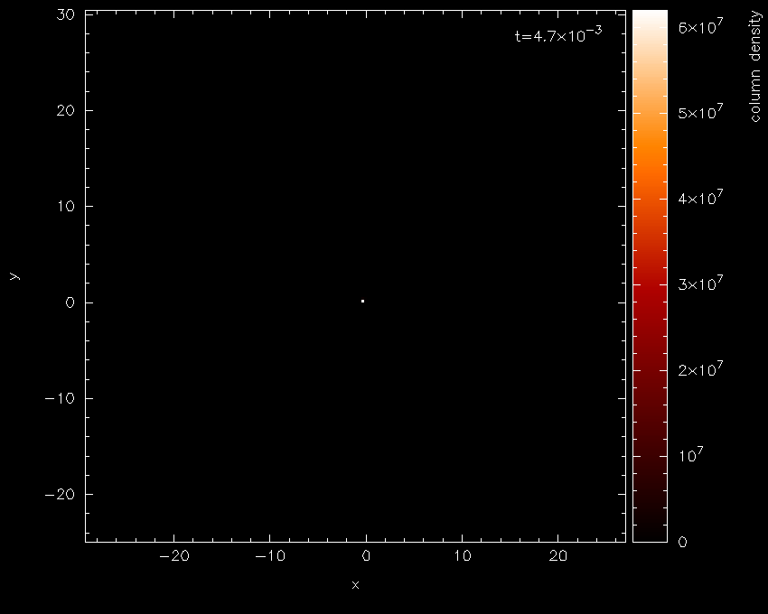

   First stage in the star formation figure tutorial: a simple render plot of density

The main thing to note is the limits on the colour bar (extending from :math:`0`
to :math:`10^{7}` on a linear scale) which is the main source of all the
blackness. Moving the cursor over the colour bar and pressing ``l`` for
log produces :numref:`fig:starpart1b` — a vast
improvement!

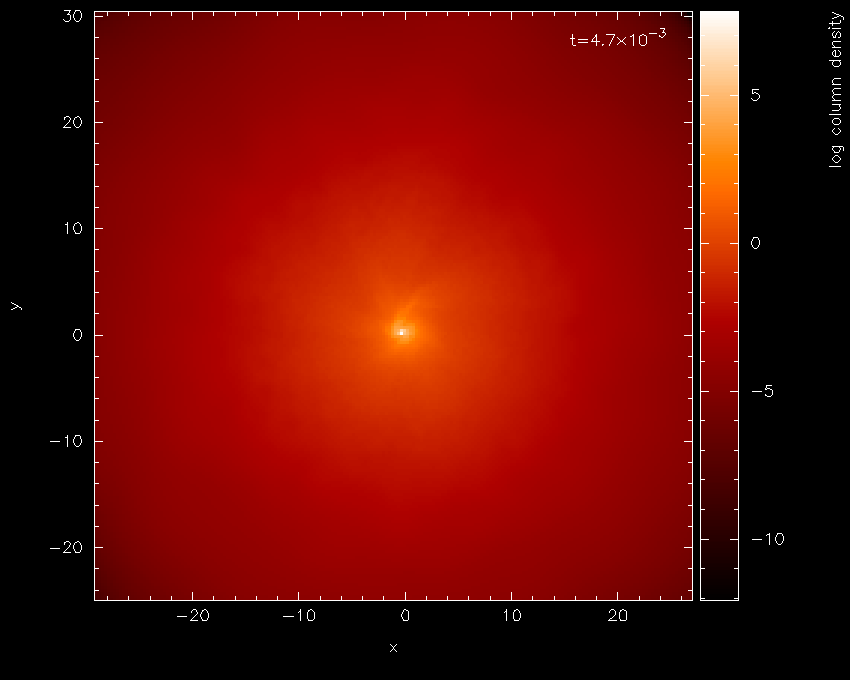

   With a log axis after having placed cursor over colour bar and pressed ``l``

For this visualisation we will eventually want the data in physical
units rather than code units. For the sphNG read these units are already
specified in the read_data routine, so all we have to do is turn
physical units on. Pressing ``q`` from interactive mode (that is, with the
cursor in the plot window) returns us to the main menu.

Physical units are turned on from the :ref:`sec:menu-d`, as follows:

::

   Please enter your selection now (y axis or option):d
   ----------------- data read options -------------------
    0) exit
    1) read new data /re-read data
    2) change number of timesteps used        (     1 )
    3) plot selected steps only               (  OFF )
    4) buffering of data on/off               (  OFF )
    5) turn calculate extra quantities on/off (  OFF )
    6) use physical units                     (  OFF )
    7) change physical unit settings
   enter option ([0:7], default=0):6
    current settings for conversion to physical units are:
   x [cm] = x x  1.000E+17
   y [cm] = y x  1.000E+17
   z [cm] = z x  1.000E+17
   particle mass [g] = particle mass x  1.991E+33
   h [cm] = h x  1.000E+17
   density [g/cm\u3\d] = density x  1.991E-18
   v\dx [cm/s] = v\dx x  3.645E+04
   v\dy [cm/s] = v\dy x  3.645E+04
   v\dz [cm/s] = v\dz x  3.645E+04
   u [erg/g] = u x  1.328E+09
   grad h = grad h x  1.000E+00
   time = time x 1.69E+00
   Use physical units? (default=yes):

returning us to the main menu with labels changed as follows:

::

   You may choose from a delectable sample of plots
   -------------------------------------------------------
     1) x [cm]                7) v\dx [cm/s]
     2) y [cm]                8) v\dy [cm/s]
     3) z [cm]                9) v\dz [cm/s]
     4) particle mass [g]    10) u [erg/g]
     5) h [cm]               11) grad h
     6) log density [g/cm\u3
   -------------------------------------------------------
    12) multiplot [  4 ]      m) set multiplot
   -------------------------------------------------------
    d(ata) p(age) o(pts) l(imits) le(g)end h(elp)
    r(ender) v(ector) x(sec/rotate) s,S(ave) q(uit)
   -------------------------------------------------------
   Please enter your selection now (y axis or option):

at this stage we will save the current settings to file by pressing ``s``
from the main menu.

::

   Please enter your selection now (y axis or option):s
    default options saved to file splash.defaults

Actually we would prefer the column labels in AU, but we will come to
that later. Replotting the same plot (that is 2, 1, 6, 0, /xw from the
main menu) plots the same plot we had before, but with the axes in
physical units. Zooming in (using the mouse) on the region of interest
and adapting the colour bar limits by moving the mouse over the colour
bar and pressing ``a`` produces the plot shown in :numref:`fig:starpart2`.

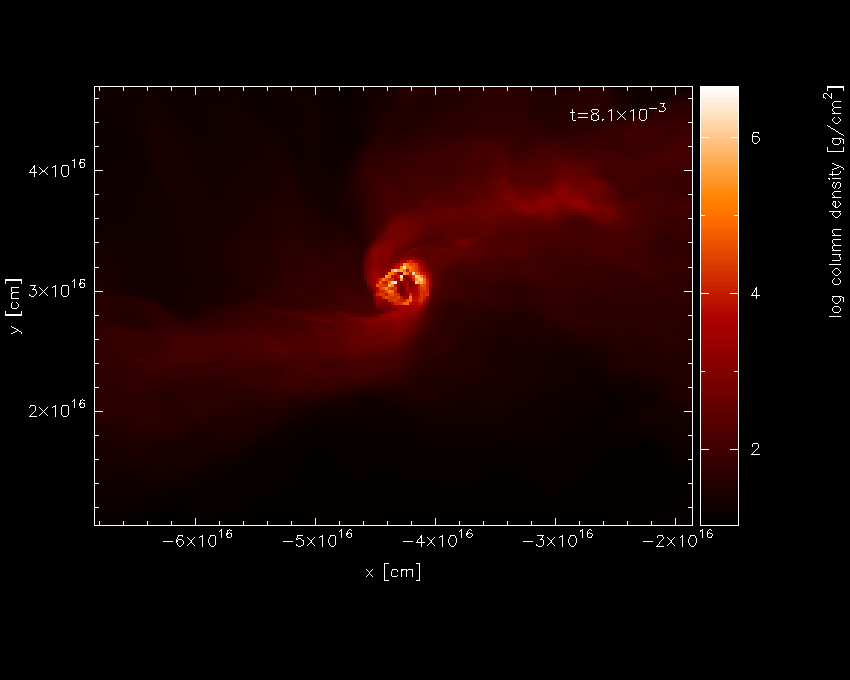

   Second stage in the star formation figure tutorial: having applied physical units, zooming in and pressing ``a`` on the colour bar

For this kind of plot, the Bate colour scheme looks better – pressing
``m`` with the mouse in the plot window changes the colour scheme,
producing the plot shown in :numref:`fig:starpart2b`.

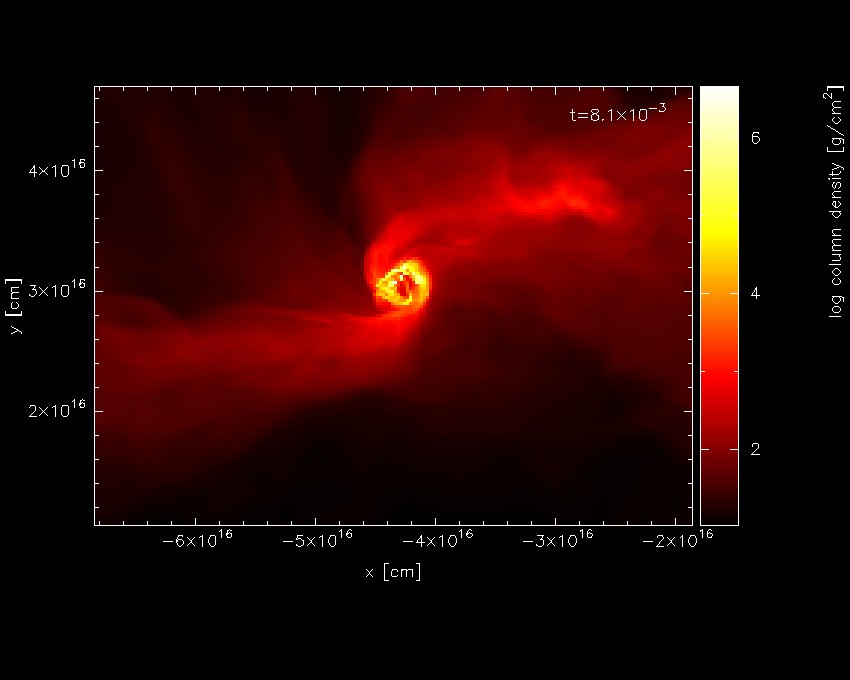

   having changed the colour scheme

Pressing ``s`` in interactive mode (that is, with the mouse in the plot window) saves the
current zoom and colour bar settings (but not to disk until you also
press ``S`` from the main menu). Pressing ``q`` from interactive mode
returns to the main menu.

Next we want to turn on the plotting of sink particles (all particle
types other than gas are turned off by default). This is done in the
:ref:`sec:menu-o` as follows:

::

    Please enter your selection now (y axis or option):o
   ------------- particle plot options -------------------
    0) exit
    1) turn on/off particles by type       ( ON, OFF, OFF, OFF )
    2) change graph markers for each type  (  1,  4, 17,  1 )
    3) set colour for each particle type   ( -1, -1, -1, -1 )
    4) plot line joining particles         ( OFF )
    5) plot smoothing circles              (   0 )
    6) use fast particle plotting          ( ON  )
    7) change coordinate systems           (  1 )
    8) plot exact solution                 (  0 )
    9) exact solution plot options
   enter option ([0:9], default=0):1
    Plot gas particles? (default=yes):
    Plot ghost particles? (default=no):
    Plot sink particles? (default=no):y
    >> Plot sink particles on top of rendered plots? (default=no):y
    Plot unknown/dead particles? (default=no):

Repeating our previous plot (i.e., 2, 1, 6, 0, /xw) produces the plot
shown in :numref:`fig:starpart3`.

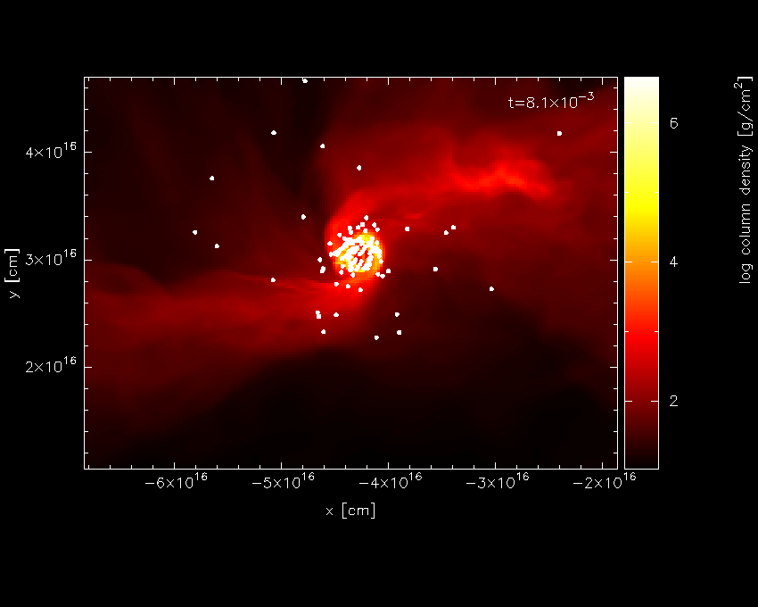

   Third stage in the star formation figure tutorial: having turned sink particle plotting on

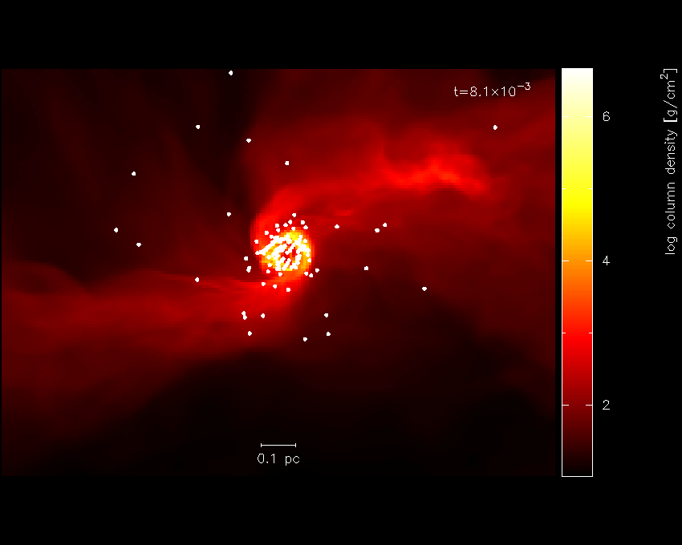

   replacing the axes with a scale

The axes in [cm] are kind of ugly, so we could either change this to a
sensible unit or plot a scale instead. We will do the latter. The axes
can be turned off in the :ref:`sec:menu-p`, as follows:

::

    Please enter your selection now (y axis or option):p
   ---------------- page setup options -------------------
   ...
    2) axes options                      ( 0)
   ...
   enter option ([0:8], default=0):2
     -4 : draw box and major tick marks only;
    -3 : draw box and tick marks (major and minor) only;
    -2 : draw no box, axes or labels;
    -1 : draw box only;
     0 : draw box and label it with coordinates;
     1 : same as AXIS=0, but also draw the coordinate axes (X=0, Y=0);
     2 : same as AXIS=1, but also draw grid lines at major increments of the coordinates;
    10 : draw box and label X-axis logarithmically;
    20 : draw box and label Y-axis logarithmically;
    30 : draw box and label both axes logarithmically.
   enter axis option ([-4:30], default=0):-2
      axis =  -2

The option to plot a scale of a particular length is also to be found in
the :ref:`sec:menu-g`. We will choose to plot a scale of length 0.1 pc.

::

   Please enter your selection now (y axis or option):g
   ---------------- legend and title options -------------------

    To set the plot titles, create a file called
     'splash.titles' in the working directory, with one title per line

    0) exit
    1) time legend on/off/settings                ( ON   0.87  1.87  0.00 "t=")
    2) titles on/off/settings                     ( ON   0.20 -0.92  0.00)
    3) legend for multiple steps per page on/off  ( OFF )
    4) plot scale on co-ordinate plots            ( OFF )
    5) legend only on nth panel/first row/column  (  0 )
   Enter option ([0:5], default=0):4
    Plot scale on co-ordinate plots? (default=no):y
    Enter length of scale in the current x,y,z units (default=1.000):3.0856e15
    Enter text to appear below scale (e.g. '10 AU') (default=1 unit): 0.1 pc
    Enter horizontal position as fraction of viewport ([0.000:1.000], default=0.5000):
    Enter vertical position in character heights above bottom (default=1.000):

Note that because the x axis units were already in cm, we simply entered
the value for 0.1pc in these units. Before plotting again, we should
save what we have done so far to disk: Pressing ``S`` from the main menu
saves both the current plot settings *and* the plot limits to disk:

::

   Please enter your selection now (y axis or option):S
    default options saved to file splash.defaults
    saving plot limits to file splash.limits

Plotting our figure again (``2``-``1``-``6``-``0``-``/xw``) produces the plot shown in :numref:`fig:starpart3`

Nearly there...! To add the finishing touches we want to increase the
number of pixels substantially. This is done in the :ref:`sec:menu-r`, option
1, for which we can use the shortcut ``r1``:

::

   Please enter your selection now (y axis or option):r1
   ----------------- rendering options -------------------
   enter number of pixels along x axis ([1:10000], default=200):1000

then, to plot the figure to file instead of the screen, we simply choose
a different device at the prompt:

::

   Please enter your selection now (y axis or option):2
   (x axis) (default=1):
    (render) (0=none) ([0:11], default=6):
    (vector plot) (0=none, 7=v) ([0:7], default=0):
    Graphics device/type (? to see list, default /xw): starpartfinal.gif/gif

producing our final finished :numref:`fig:starfinal`.

.. figure:: figs/starpartfinal.png
   :alt: Finished star formation plot
   :name: fig:starfinal
   :width: 50.0%

   Finished star formation plot

Pressing ``S`` from the main menu saves all of the settings and plot
limits to disk, so invoking splash again will produce the same plot. To
produce the same plot on a sequence of dumps, simply put more than one
file on the command line and plot to a non-interactive device (see
:ref:`sec:movies`). Use the postscript devices /ps or /cps (for
colour) to make figures suitable for inclusion in a paper.

Other things you may want to do with this plot include:

-  Turn the time legend off. See :ref:`sec:legendoff`.

-  Change the colour of sink particles. See
   :ref:`sec:partcolours`.

-  Change the foreground/background colour of the page. See
   :ref:`sec:pagecolours`.

Multi-panelled figure
---------------------
The following is an example plot taken from [PB07]_.
Here I will plot a sequence of plots tiled on the same page, so that
columns correspond to dumps taken from different runs at the same time
and rows correspond to an evolutionary sequence from a given run. The
plot uses sphNG data which contains sink particles, so I also want these
to appear on the plots and be plotted in white. Basically I want the
plots to be plotted such that as much of the plot is taken up by data
and very little by axes and the like but still conveying all of the
necessary information.

We proceed as follows: Firstly, each different run (corresponding in
this case to a series of runs with different magnetic field strength)
are in different subdirectories with names like ``mbossbod_f10.0/``,
``mbossbod_f5.0/``, etc. which all contain a sequence of dump files with
names like ``mbos001``, ``mbos002`` etc. To begin the plot, I start by
creating a new, empty subdirectory so that the ``splash.defaults`` and
``splash.limits`` files created by pressing ``S`` from the main menu will
be in this directory such that running splash from that directory always
produces this plot. So:

::

   dprice% mkdir plot1
   dprice% cd plot1

then having decided which dump files from each run to use, I create a
text file listing these filenames (with the full relative pathname) in
the order in which I will plot them. For example, calling this file
(arbitrarily) ``filelistplot``, the contents should be something like
the following:

::

   dprice% more filelistplot
   ../mbossbod_f20.0/mbos259
   ../mbossbod_f20.0/mbos263
   ../mbossbod_f20.0/mbos268
   ../mbossbod_f20.0/mbos275
   ../mbossbod_f20.0/mbos294
   ../mbossbod_f10.0/mbos259
   ../mbossbod_f10.0/mbos263
   ../mbossbod_f10.0/mbos268
   ../mbossbod_f10.0/mbos275
   ../mbossbod_f10.0/mbos294
   ../mbossbod_f7.5/mbos259
   ../mbossbod_f7.5/mbos263
   ../mbossbod_f7.5/mbos268
   ...

Then invoke splash with these filenames on the
command line:

::

   splash `cat filelistplot`

after which the first dump file should be read, indicated by output
along the lines of:

::

    reading single dumpfile
   >>>>>>>>>>>>>>>>>>>>>>>>>> ../mbossbod_f20.0/mbos259 <<<<<<<<<<<<<<<<<<<<<<<<<<
   double precision dump
   File ID: SHydroRTMHD1
    npart =  491567
   ...

An alternative method is to rename the ``filelistplot`` file
``splash.filenames``, from which the filenames will be read if there are
none specified on the command line (this feature was implemented as a
workaround for a limit to the number of command line arguments on the
some compilers).

The first stage is to get a plot of a single panel looking good. So,
from the main menu, we will plot a simple rendering of density and
adjust the plot limits until we are happy:

::

    You may choose from a delectable sample of plots
   -------------------------------------------------------
     1) x                     6) density
     2) y                     7) B\dx
     3) z                     8) B\dy
     4) particle mass         9) B\dz
     5) h
   -------------------------------------------------------
    10) multiplot [  4 ]      m) set multiplot
   -------------------------------------------------------
    d(ata) p(age) o(pts) l(imits) le(g)end h(elp)
    r(ender) v(ector) x(sec/rotate) s,S(ave) q(uit)
   -------------------------------------------------------
   Please enter your selection now (y axis or option):2
    (x axis) (default=1):
    (render) (0=none) ([0:9], default=0):6
    (vector plot) (0=none, 7=B) ([0:7], default=0):
     Graphics device/type (? to see list, default /xw): /xw

which should produce the plot shown in :numref:`fig:multipart1`. Not much can be seen at
first – just a few white dots. This is mainly a result of the density
axis (i.e., the colour bar) not being logged.

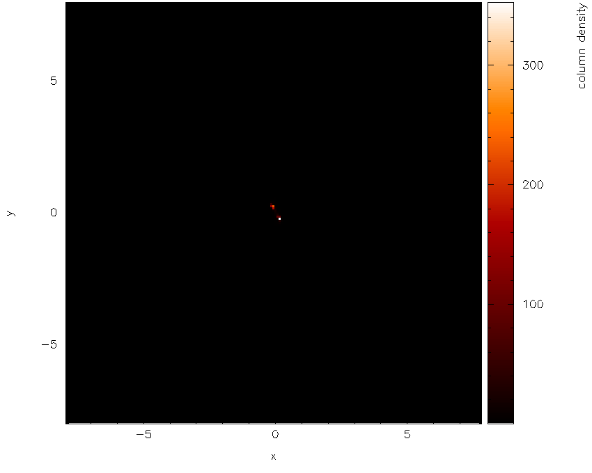

   First stage in the multi-panelled figure tutorial: a simple render plot of density

Moving the cursor over the
colour bar and pressing ``l`` results in the plot shown in :numref:`fig:multipart1b`

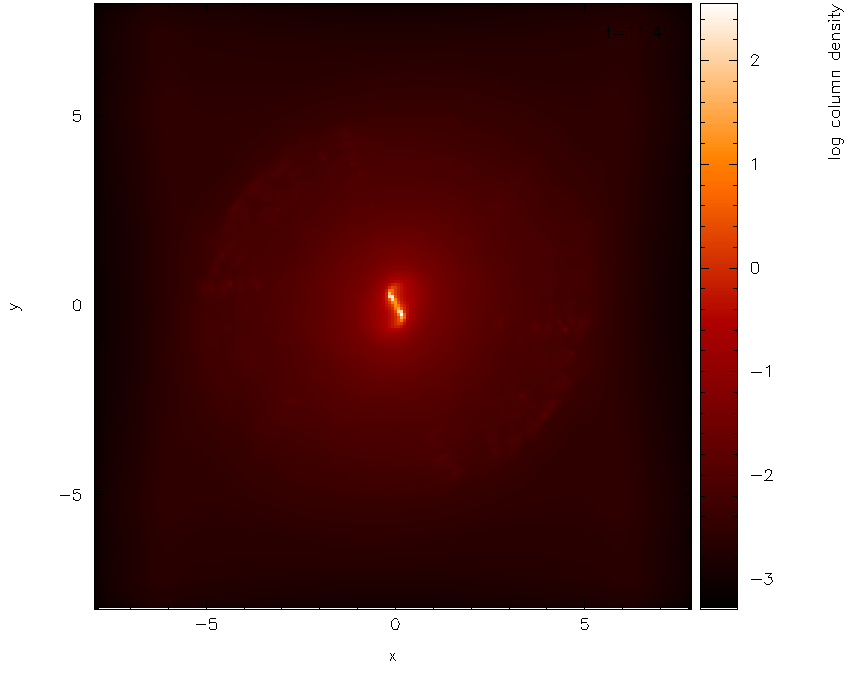

   and with a log axis after having placed cursor over colour bar and pressed ``l``

Before we proceed any further, we will first change the axes to be in
physical units rather than code units. Pressing ``q`` in the plot window
to exit interactive mode and return to the main menu, and from the :ref:`sec:menu-d`,
turn the ``use physical units`` option on:

::

   Please enter your selection now (y axis or option):d
   ----------------- data read options -------------------
    0) exit
    1) read new data /re-read data
    2) change number of timesteps used        (     1 )
    3) plot selected steps only               (  OFF )
    4) buffering of data on/off               (  OFF )
    5) turn calculate extra quantities on/off (  OFF )
    6) use physical units                     (  OFF )
    7) change physical unit settings
   enter option ([0:7], default=0):6
    current settings for conversion to physical units are:
   x [cm] = x x  1.000E+16
   y [cm] = y x  1.000E+16
   z [cm] = z x  1.000E+16
   particle mass [g] = particle mass x  1.991E+33
   h [cm] = h x  1.000E+16
   density [g/cm\u3\d] = density x  1.991E-15
   B\dx [G] = B\dx x  1.000E+00
   B\dy [G] = B\dy x  1.000E+00
   B\dz [G] = B\dz x  1.000E+00
   time = time x 1.13E-01
   Use physical units? (default=yes):yes

The default transformations to physical units are in this case set in
the data read. However it would be nicer in this case to set the x and y
axis units to AU (Astronomical Units), rather than cm.
From the :ref:`sec:menu-d` we proceed as follows:

::

   enter option ([0:7], default=0):7
    enter column to change units (-2=reset all,-1=quit,0=time) ([-2:9], default=-1):1
    enter x [cm] units (new=old*units) (default=0.1000E+17):668.3893
    enter label amendment (default=[cm]): [AU]
    Apply these units to all coordinates and h? (default=yes):
    Enter unit for 'z' in 3D column integrated plots (default=0.1000E+17):
    Enter label for z integration unit (e.g. [cm]) (default=[cm]):

   enter column to change units (-2=reset all,-1=quit,0=time) ([-2:9], default=-1):

   save units to file? (default=yes):
    saving plot limits to file splash.units

where in the above I set the multiplicative factor such that the x axis
will be in AU and correspondingly changed the units label to ``[AU]``
(note the preceding space). I was also prompted to change the unit for
’z integration’ – this is the length unit added when integrating a
quantity through z. Leaving this in cm means that, even though the
coordinate axes are in AU, the density (in g/cm\ :math:`^{3}`) is
integrated through z in cm, giving column density in g/cm\ :math:`^{2}`
(as opposed to g /cm:math:`^{3}` AU).

To save what we have done so far, press ``s`` from the main menu to save
the current settings to the ``splash.defaults`` file:

::

    Please enter your selection now (y axis or option):s
    default options saved to file splash.defaults

Having turned physical units on, we replot the same plot (i.e.,
answering ``2``, ``1``, ``6``, ``0``, ``/xw`` to the prompts, as previously). First of all
we find simply a white screen. This is a result of the colour bar axis
now being wrong. Moving the mouse over the colour bar and pressing ``a``
(to adapt) results in the plot shown in :numref:`fig:multipart3`. The plot looks
basically identical to the previous plot, except that the axes are now
in physical units (x and y are in AU and column density is in
g/cm\ :math:`^{2}`).

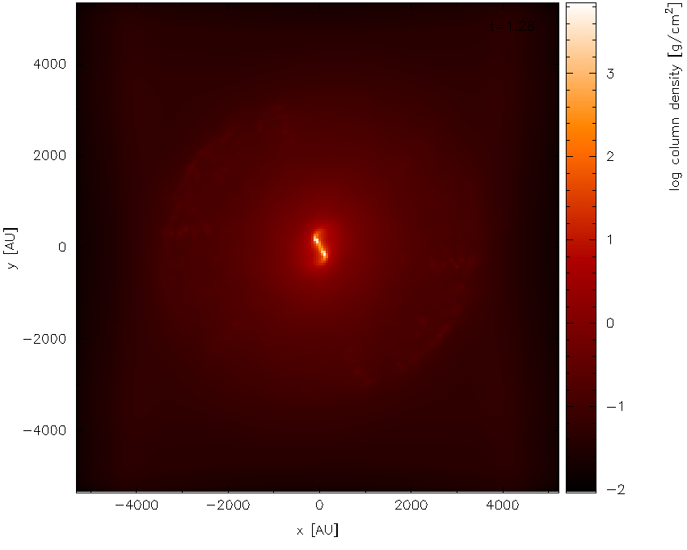

   Second stage in the multi-panelled figure tutorial: having changed the axes into physical units

Next, we zoom in to the central region of interest using the mouse –
selecting a region and clicking to zoom in. Pressing ``o`` centres the
plot on the origin and as we zoom in it we also press ``a`` over the
colour bar to readjust the colour bar limits to the max/min on the
zoomed-in plot. Finishing with the adjustments (and pressing ``s`` in the
plot window to save the current settings) results in the plot shown in
:numref:`fig:multipart3b`.

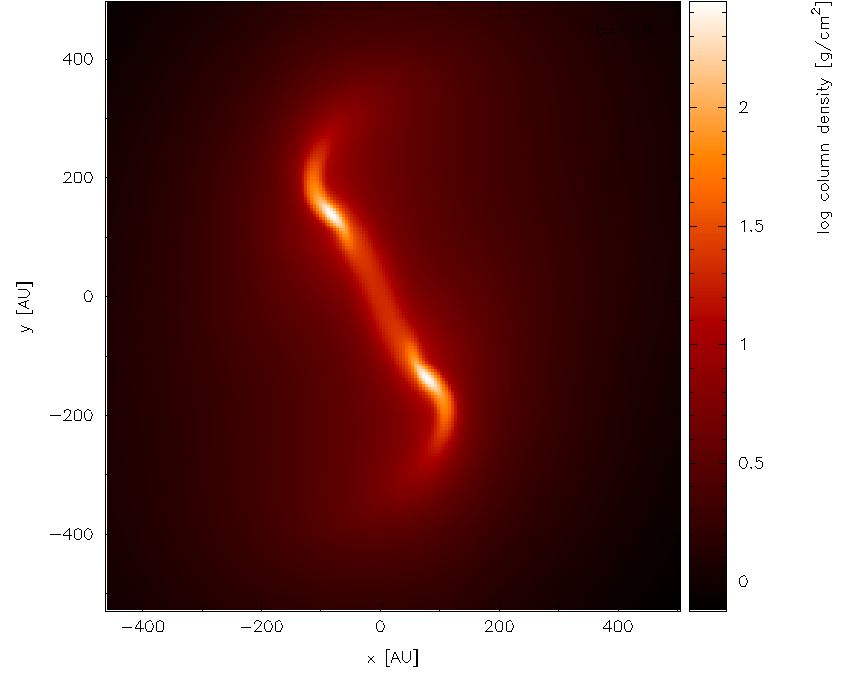

   zooming in and adjusting the colour bar

Surface rendering
-----------------

Here I will give an example of how to use the 3D surface rendering
feature starting with a dump file kindly supplied by Giuseppe Lodato
from an SPH simulation of a warped accretion disc. First we read the
file:

::

   dprice$ splash warp001

after which we reach the main menu:

::

    You may choose from a delectable sample of plots
   -------------------------------------------------------
     1) x                     6) density
     2) y                     7) v\dx
     3) z                     8) v\dy
     4) particle mass         9) v\dz
     5) h
   -------------------------------------------------------
    10) multiplot [  4 ]      m) set multiplot
   -------------------------------------------------------
    d(ata) p(age) o(pts) l(imits) le(g)end h(elp)
    r(ender) v(ector) x(sec/rotate) s,S(ave) q(uit)
   -------------------------------------------------------
   Please enter your selection now (y axis or option):

Firstly we want to plot just a simple render plot of density. Thus we
choose:

::

    Please enter your selection now (y axis or option):2
   (x axis) (default=1):
    (render) (0=none) ([0:9], default=0):6
    (vector plot) (0=none, 7=v) ([0:7], default=0):
    Graphics device/type (? to see list, default /xwin): /xw

producing the plot shown in :numref:`fig:surfpart1` (I have used ``/png``
instead of ``/xw`` to produce the figures for the userguide).

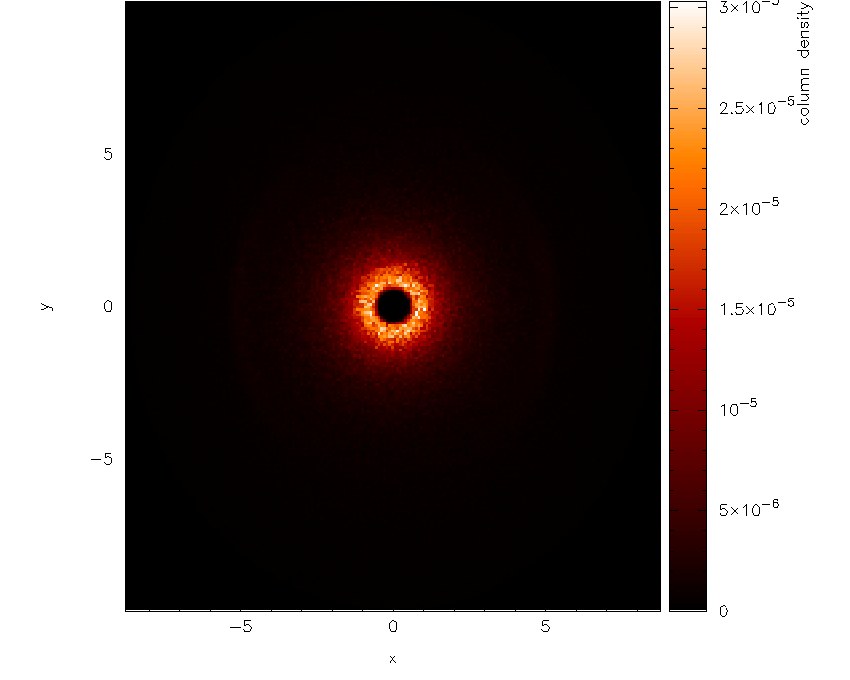

   First stage in the surface rendering tutorial: a simple render plot of density

Moving the cursor over the colour bar and pressing ``l`` to log the colour bar axis
produces :numref:`fig:surfpart1b`.

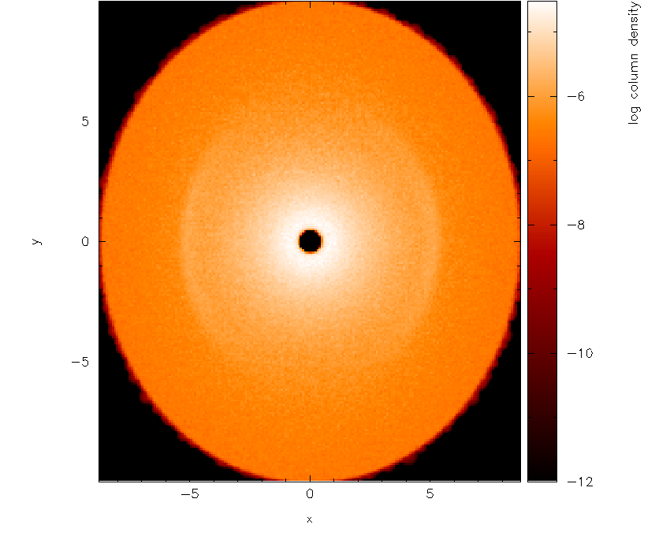

   with a log axis after having placed cursor over colour bar and pressed ``l``

The next step is to adjust the viewing angle. Pressing ``h`` in the plot
window brings up the list of keystrokes which can be used to change the
angle. Here we want to add a rotation about the :math:`x-` axis, so we
press ``{`` three times to change the x angle by -90 degrees and then
press ``[`` once to increment the angle by a further -15 degrees. The
splash output in the terminal reads, amongst other things:

::

    rotating particles about z by   0.00
    rotating particles about y by   0.00
    rotating particles about x by 255.00

Then we obtain :numref:`fig:surfpart2`.

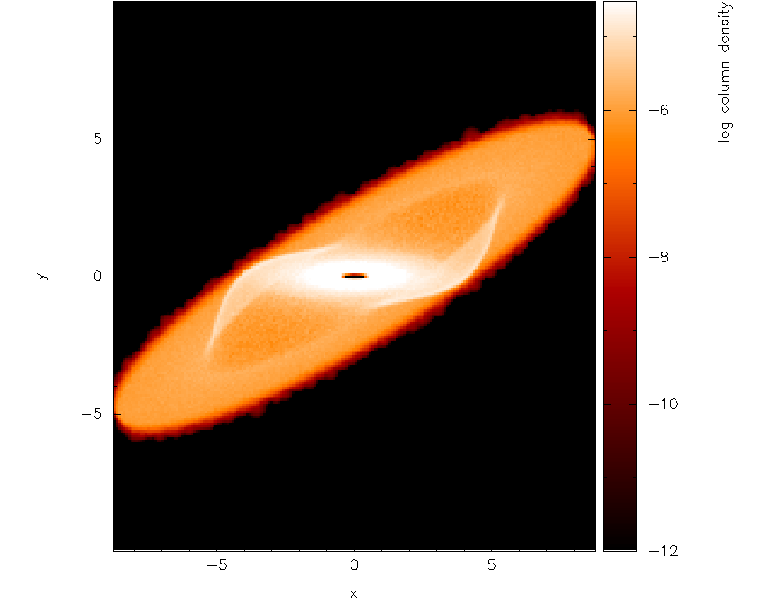

   Second stage in the surface rendering tutorial: after adjusting the rotation angle

Next, we need to turn the 3D surface rendering on. This cannot be done
in interactive mode so we need to exit – pressing ``s`` first to save what
we have done so far, then ``q`` to quit interactive mode. Then, back at
the splash main menu, we type x4 for the :ref:`sec:menu-x`,
option 4 which is “3D surface rendering on/off” with prompts appearing
as follows:

::

   Please enter your selection now (y axis or option):x4
   ---------- cross section / 3D plotting options --------
   Use 3D opacity rendering? (default=yes):y

Now we replot the original plot with the new settings as follows:

::

   Please enter your selection now (y axis or option):2
   (x axis) (default=1):
    (render) (0=none) ([0:9], default=6):
    (vector plot) (0=none, 7=v) ([0:7], default=0):
    enter z coordinate of observer (default=53.58):
    enter distance between observer and projection screen ([0.000:], default=5.358):
    using current h and pmass limits to calculate kappa (cross section/unit mass)
    min h =  0.1197254  min particle mass =  3.812551E-11
    [ kappa = pi*h_min**2/(particle_mass*n_smoothing_lengths) ]
   enter approximate surface depth (number of smoothing lengths): ([0.000:], default=2.000):
    kappa (particle cross section per unit mass) =  1.2369025E+9
    Graphics device/type (? to see list, default /xwin):

Note that several new prompts appear – for the moment I have just used
the default answers by pressing return. The first result is rather
frightening : just a black image with a black colour bar! This is
because the limits we set for column density are several orders of
magnitude away from the limits on density. Moving the cursor over the
colour bar and pressing ``a`` to adapt the limits produces the plot shown
in :numref:`fig:surfpart2b`.

.. figure:: figs/surfpart4.png
   :alt: surface rendering tutorial part 2b
   :name: fig:surfpart2b
   :width: 50.0%

   With 3D surface rendering turned on (which also turns on 3D perspective) and having adjusted the colour bar limits

Note that the plot suddenly appears much smaller – this is a consequence
of the 3D perspective settings. Moving the cursor into the plot window
and pressing ``a`` adapts the plot limits. After also clicking on the
colour bar and adjusting the colour bar limits, we arrive at the plot
shown in :numref:`fig:surfpart3`.

.. figure:: figs/surfpart5.png
   :alt: surface rendering tutorial part 3
   :name: fig:surfpart3
   :width: 50.0%

   Third stage in the surface rendering tutorial: after adjusting the xy and colour bar limits interactively

Now that we are nearly there, to add the finishing touches we need to i)
increase the number of pixels in the image and ii) turn the axes off,
since they are no longer meaningful with 3D perspective set. The number
of pixels can be increased by returning to the splash main menu
(pressing ``s`` in interactive mode before doing so to save what we have
done so far), then typing ``r1`` for :ref:`sec:menu-r`, option 1:

::

   Please enter your selection now (y axis or option):r1
   ----------------- rendering options -------------------
   enter number of pixels along x axis ([1:10000], default=200):1000

Next, we turn the axes off using the :ref:`sec:menu-p`:

::

   Please enter your selection now (y axis or option):p2
   ---------------- page setup options -------------------
    -4 : draw box and major tick marks only;
    -3 : draw box and tick marks (major and minor) only;
    -2 : draw no box, axes or labels;
    -1 : draw box only;
     0 : draw box and label it with coordinates;
     1 : same as AXIS=0, but also draw the coordinate axes (X=0, Y=0);
     2 : same as AXIS=1, but also draw grid lines at major increments of the coordinates;
    10 : draw box and label X-axis logarithmically;
    20 : draw box and label Y-axis logarithmically;
    30 : draw box and label both axes logarithmically.
   enter axis option ([-4:30], default=0):-2
     axis =  -2

Plotting the same plot again now results in the plot shown in :numref:`fig:surfpart3b`.

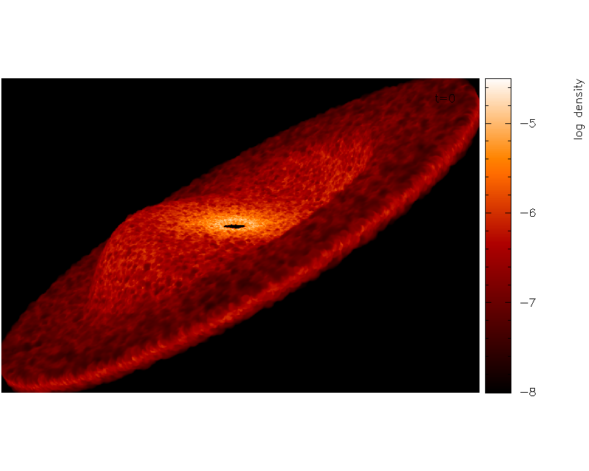

   and increasing the number of pixels and having turned the axes off

Finally we will also set the background colour to black, adjust the
opacity and move the time legend. Notice that in :numref:`fig:surfpart3b` the surface looks
blotchy. This is an indication that the surface is too shallow (that is
we are only seeing particles on the very top). Thus we will adjust the
opacity for a slightly deeper plot. We proceed as follows: Exiting
interactive mode (pressing ``s`` then ``q`` in the plot window), we first
set the foreground and background colours in the :ref:`sec:menu-p`:

::

   Please enter your selection now (y axis or option):p8
   ---------------- page setup options -------------------
   Enter background colour (by name, e.g. "black") (default=):black
    Enter foreground colour (by name, e.g. "white") (default=):white
    Do you want to plot axes and overlaid text in background colour (default is foreground) ? (default=no):

Now, replotting the same plot again, but this time adjusting the opacity
at the prompt:

::

   enter approximate surface depth (number of smoothing lengths): ([0.000:], default=2.000):200.0

Finally, moving the time legend by positioning the cursor and pressing
’G’ and zooming out slightly by pressing ``-`` once, we arrive at our
finished figure (or movie frame) shown in :numref:`fig:surfpartfinal`. Pressing ``s`` in
interactive mode saves the settings, then pressing ``q`` returns to the
splash main menu. To :ref:`sec:menu-s` to disk, press ``S`` from the main
menu to save both the ``splash.defaults`` file and the ``splash.limits``
file.

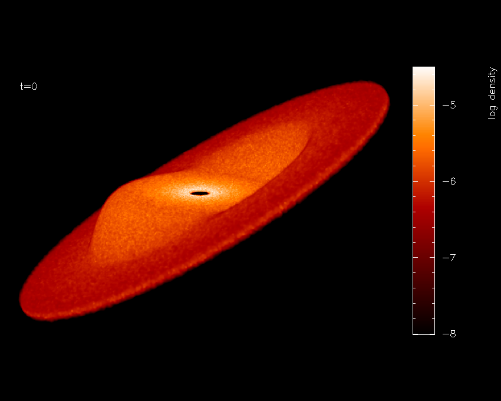

   Finished surface-rendered plot

To create a sequence of images with these settings, then simply invoke
splash again with multiple files:

::

   splash warp???

then plotting the same plot as previously to a non-interactive device
will cycle through all dump files producing a sequence of plots with
names like ``splash_0000.png``, ``splash_0001.png`` etc. These can be
easily converted into an animation.

.. _sec:evsplash:

Using splash to plot energy vs time plots
------------------------------------------

splash can be used for all kinds of data. For example I often use it to plot the
contents of the .ev file my SPH code dumps monitoring quantities like
energy and angular momentum at every timestep. A shortcut way of setting
options appropriate to reading such files (e.g. plotting lines instead
of dots, plotting all files on the same page) is implemented by adding
the “-ev” option to the command line: e.g.

::

   splash -ev file1.ev file2.ev file3.ev

also, using the -ev option on the command line means that any
modification to the preset options /limits are saved to files called
``evsplash.defaults`` and ``evsplash.limits`` instead of the usual
``splash.defaults`` and ``splash.limits``. This means the defaults for
this type of plot are saved separately to those for “normal” plots of
SPH data.

For other command line options, see :ref:`sec:commandline`.

.. _sec:surfdens:

Plotting azimuthally-averaged disc surface density and Toomre Q parameter
-------------------------------------------------------------------------

For analysis of accretion disc simulations, it is useful to make
azimuthally averaged plots of the disc properties such as the surface
density and, for self-gravitating discs, the Toomre Q parameter. Extra
columns appear to plot both of these quantities when the simulation is
3D and the coordinate system is changed to cylindrical or spherical
co-ordinates (in the :ref:`sec:menu-o` – see
:ref:`sec:geom`). For the Toomre Q parameter to appear it is
also necessary to have read the thermal energy from the dump file. For
example, having read a dump file, change the coordinate system to
cylindricals:

::

   Please enter your selection now (y axis or option):o7
   ------------- particle plot options -------------------
    0) reset (= 1)
    1) cartesian   x,y,z
    2) cylindrical r,phi,z
    3) spherical   r,phi,theta
    4) toroidal    r,theta,phi
   Enter coordinate system to plot in: ([0:4], default=1):2

then extra columns appear in the menu:

::

    You may choose from a delectable sample of plots
   -------------------------------------------------------
     1) r                    13) u
     2) phi                  14) grad h
     3) z                    15) grad soft
    ...                         ...
    11) v\dphi               23) Surface density
    12) v\dz                 24) Toomre Q parameter
   -------------------------------------------------------

Then (in this example), select column 23 to plot surface density,

::

   Please enter your selection now (y axis or option):23
    setting x axis to r for surface density plot

...and the plot will appear - an example surface density plot is shown
in :numref:`fig:surfdens`.

.. figure:: figs/surfdens.pdf
   :alt: Azimuthally averaged surface density
   :name: fig:surfdens
   :width: 50.0%

   Plot of azimuthally averaged surface density in a 3D accretion disk
   simulation

Azimuthally averaged quantities are calculated by binning the particles
into a fixed number of annuli in radius. The mean surface density is
calculated using

.. math:: \Sigma(r_{ann}) = \frac{M_{ann}}{\pi [(r_{ann} + 0.5\Delta r)^{2} - (r_{ann} - 0.5\Delta r)^{2}]},

that is, the total mass in the annulus (sum of the particle masses)
divided by its area, where :math:`r_{ann}` is the radius (cylindrical or
spherical) of the annulus. The Toomre Q parameter, defined as

.. math:: Q_{Toomre}(r) = \frac{\bar{c}_{s}(r)\kappa(r)}{\pi \Sigma(r)},

where :math:`\kappa` is the epicyclic frequency and :math:`\bar{c}_{s}`
is the RMS sound speed, is calculated using the above surface density,
assuming a Keplerian rotation profile and a central star mass of unity
(i.e., :math:`\kappa(r) = \Omega(r)`, where
:math:`\Omega(r) = r^{-3/2}`). The sound speed for each particle
:math:`i` is calculated from the stored thermal energy and
:math:`\gamma` (ratio of specific heats) according to

.. math::

   c_{s,i}^{2} = \left\{ \begin{array}{ll}
   \frac23 u_{i}, & \gamma = 1; \\
   (\gamma-1)\gamma u_i, & \gamma \neq 1;
   \end{array}\right.

from which the RMS sound speed is calculated as the square root of the
average of :math:`c_{s}^{2}` on the particles in the annulus.
