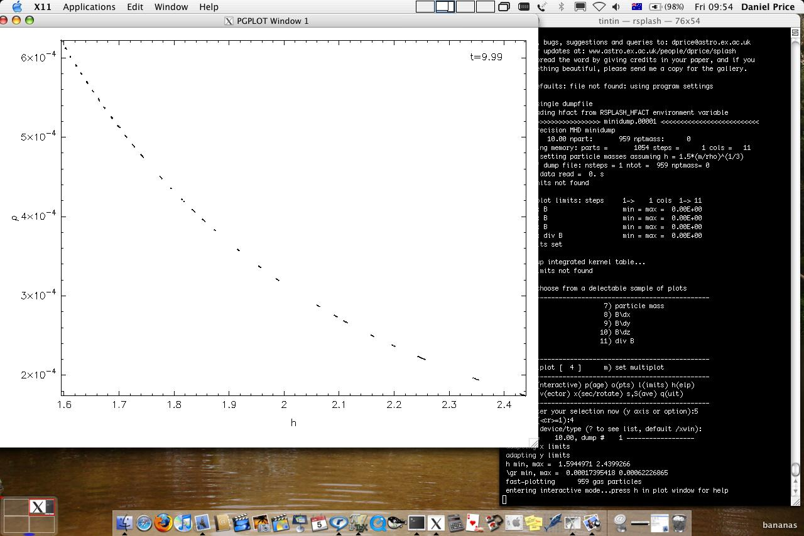
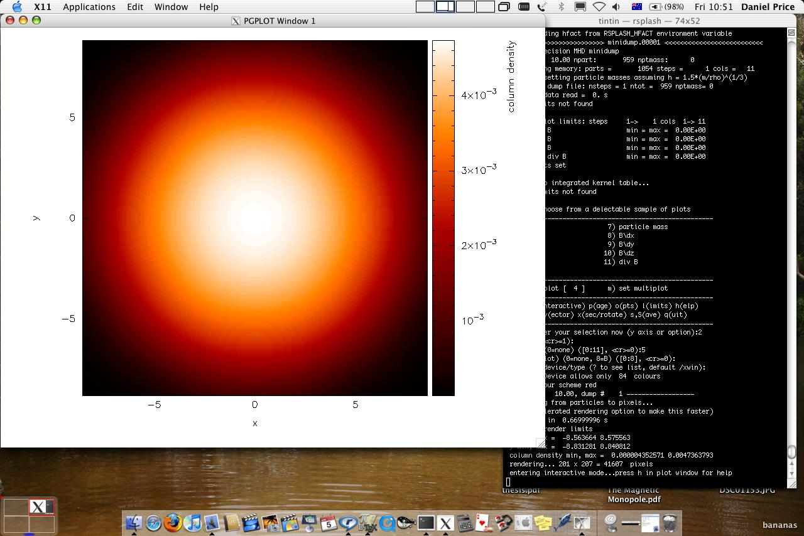
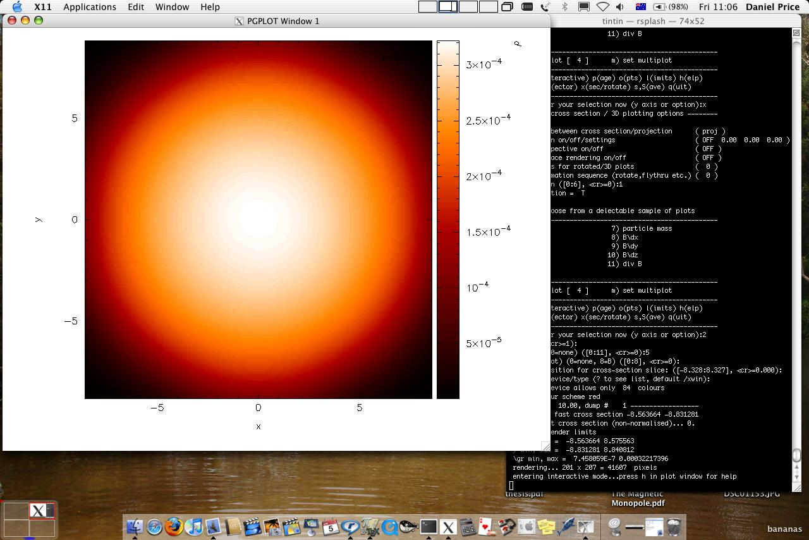
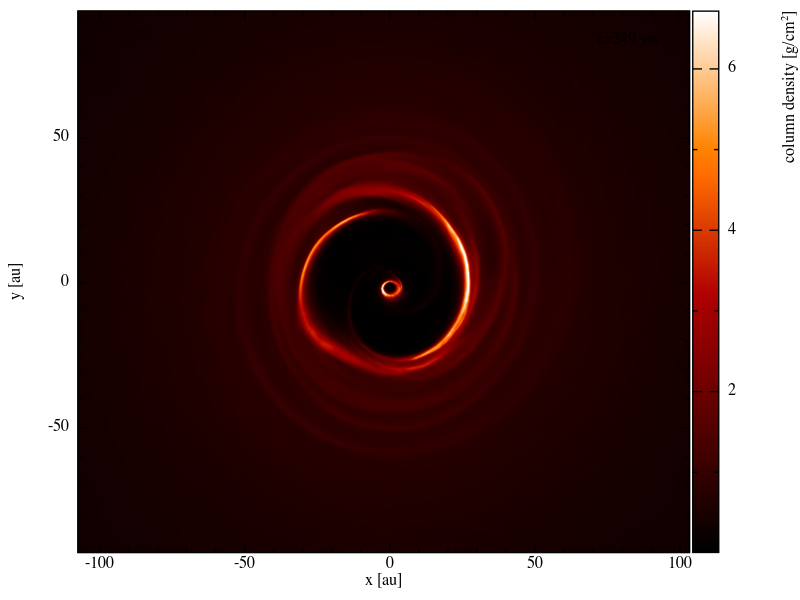
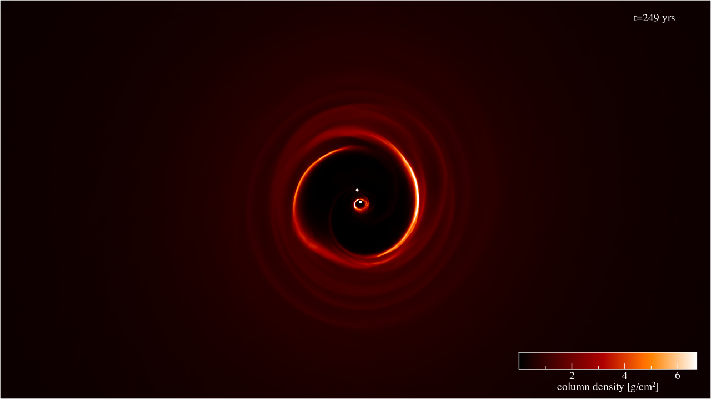

.. _sec:basic:

Basic splash usage
==================

Simple two column plot
----------------------

Once you have successfully compiled splash with a read data file that
will read your data format, splash is invoked with the name of the data
file(s) on the command line, e.g.

::

   splash myrun*.dat

| where splash should be replaced with `splash -f gadget`, `splash -f magma` etc.
  depending on the data format.
| After a successful data read, the menu should appear as something like
  the following (the example given is for a “minidump” from Stephan
  Rosswog’s SPH code, MAGMA):

::

   dprice$ splash -magma minidump.00001

::

       _                                                 _
      (_)   _               _           _         _     (_)_
         _ (_)    ___ _ __ | | __ _ ___| |__     (_)   _  (_)
      _ (_)  _   / __| '_ \| |/ _` / __| '_ \       _ (_)
     (_)  _ (_)  \__ \ |_) | | (_| \__ \ | | |  _  (_) _
         (_)  _  |___/ .__/|_|\__,_|___/_| |_| (_)  _ (_)
             (_)  (_)|_| (_) (_)  (_)(_) (_)(_) (_)(_)

     ( B | y ) ( D | a | n | i | e | l ) ( P | r | i | c | e )

   ...etc...

::

    You may choose from a delectable sample of plots
   -------------------------------------------------------
     1) x                     7) particle mass
     2) y                     8) B\dx
     3) z                     9) B\dy
     4) h                    10) B\dz
     5) \gr                  11) div B
     6) T
   -------------------------------------------------------
    12) multiplot [  4 ]      m) set multiplot
   -------------------------------------------------------
    d(ata) p(age) o(pts) l(imits) le(g)end h(elp)
    r(ender) v(ector) x(sec/rotate) s(ave) q(uit)
   -------------------------------------------------------
   Please enter your selection now (y axis or option):

The simplest plot is of two quantities which are not both coordinates.
For example, to plot density vs smoothing length, type

::

   Please enter your selection now (y axis or option): 5
   (x axis) (default=1): 4
    Graphics device/type (? to see list, default /xwin): /xw

The ``default=`` refers to the default value assigned if you just press
the return key. The last prompt asks for the device to which output
should be directed.

.. hint::
   A full list of available graphics devices is given by typing ``?`` at the prompt.

Some of the most useful devices are given
in :ref:`tab:devices`. In the above we have selected
the X-window driver which means that the output is sent to the screen
(provided X-windows is running), as demonstrated in the screenshot shown
in :numref:`fig:rhoh`.

   Screenshot of simple two column plot to an X-window

.. table:: Commonly used graphics devices available in giza
   :name: tab:devices

   +-----------------+-----------------+-----------------+-----------------+
   | ``/xw``,        | X-Window        | ``/png``        | Portable        |
   | ``/xwin``       | (interactive)   |                 | Network         |
   |                 |                 |                 | Graphics        |
   |                 |                 |                 | (bitmap)        |
   +-----------------+-----------------+-----------------+-----------------+
   | ``/eps``        | Encapsulated    | ``/svg``        | Scalable Vector |
   |                 | postscript (one |                 | Graphics        |
   |                 | file per page)  |                 |                 |
   +-----------------+-----------------+-----------------+-----------------+
   | ``/pdf``        | PDF             | ``/null``       | null device (no |
   |                 |                 |                 | output)         |
   +-----------------+-----------------+-----------------+-----------------+
   | ``/ps``         | Postscript (all |                 |                 |
   |                 | pages in one    |                 |                 |
   |                 | file)           |                 |                 |
   +-----------------+-----------------+-----------------+-----------------+

.. _sec:interactive:

Interactive mode
-----------------

Many useful tasks can now be achieved by moving the mouse to the plot
window and selecting areas or pressing keystrokes – this is :ref:`sec:interactive`.
Most useful are:

- press ``l`` with the mouse over the colour bar for a *log axis*

- ``a`` to *adapt the plot limits* (with mouse on the colour bar, inside the plot, or positioned next to the x or y axes)

- ``left click`` to *select an area* with the mouse and ``click`` to *zoom*

- ``left click`` on the colour bar to *change the rendering limits*

- ``space`` to *skip to the next file* (``right click`` or ``b`` to go back)

- ``-`` or ``+`` to *zoom in* or *out*

- ``Enter`` for :ref:`sec:hollywood`

- ``o`` to *recentre the plot* on the origin

- ``r`` to *refresh* the plot (e.g. after changing the window size)

- ``g`` to *plot a line and find its gradient*

- ``m`` or ``M`` to *change the colour map*

- ``f`` to *flip the rendering* to the next quantity

- ``<``, ``>``, ``{``, ``}`` and ``/``, ``\`` to *rotate particles* around *z*, *y* and *x axes*, respectively

- ``G`` to *move the legend*

- ``ctrl-t`` to *annotate with text*

- ``backspace`` to delete annotation

- ``s`` in the plot window to *save changes* between timesteps, otherwise the settings
  will revert when you move to the next timestep.

- ``q`` in the plot window to *quit the plotting window* and return to the menu

- ``q`` again from the splash main menu to *quit splash altogether*.

- ``h`` in the plot window for the full list of commands

On particle plots you can additionally:

- select an area and press ``0``-``9`` to *colour particles* (particle colours stick
  between plots, so you can use this to find particles with unusual parameters)

- select an area and press ``0`` to *hide selected particles*

- move the mouse over a particle and press ``c`` to see the size of the *smoothing
  circle* for that particle

These tasks can also be achieved non-interactively by a series of
text-based :ref:`sec:menu` (see :ref:`sec:settings`). For example limits changing options are contained in the
:ref:`sec:menu-l`, so to manually set plot limits we would type ``l`` from
the main menu, then ``2`` for option 2 (set manual limits) and follow the
prompts to set the limits for a particular data column.
See also :ref:`sec:menu-i`.

.. _sec:renderplot:

Rendered plots
--------------

A more complicated plot is where both the :math:`x-` and :math:`y-` axes
refer to coordinates. For example

::

   Please enter your selection now (y axis or option):2
   (x axis) (default=1): 1
   (render) (0=none) ([0:11], default=0):5
   (vector plot) (0=none, 8=B) ([0:8], default=0):0
   Graphics device/type (? to see list, default /xwin): /xw

You can produce the same graph without answering prompts using::

   splash -y 2 -x 1 -r 5 -dev /xw minidump.00001

or, since the other options are default anyway, simply::

   splash -r 5 minidump.00001

Notice that in this case that options appeared for rendered and vector
plots. Our choice of ``5`` at the (render) prompt corresponds to column 5,
which in this case is the density, producing the plot shown in the
screenshot in :numref:`fig:renderplot`.

   Screenshot of 3D column density plot to an X-window

.. important::
   Rendered plots only work if columns for density, particle mass and
   smoothing length are correctly identified in the data, and provided the
   number of coordinates is 2 or greater. Without these, rendering will
   just colour the points according to the selected column.
   See :ref:`sec:writeyourown` for internal details.

.. _sec:xsec:

Cross section
--------------

To plot a cross section slice instead of a projection in 3D, simply
use ``--xsec`` flag on the command line::

  splash --xsec -r 5 minidump.00001

Or, type ``x`` at
the main menu to open the :ref:`sec:menu-x` and
choose option ``1) switch between cross section and projection``. Then
re-plot the rendered plot again (exactly as in the previous example
:ref:`sec:renderplot`), setting the slice position at the prompt:

::

   enter z position for cross-section slice: ([-8.328:8.327], default=0.000):

which produces the plot shown in the screenshot in :numref:`fig:renderplot_xsec`

   Screenshot of 3D :ref:`sec:xsec` slice plot to an X-window

.. _sec:vectorplots:

Vector plots
------------

A prompt to plot vector arrows on top of :ref:`sec:renderplot` (or on top of
particle plots) appears whenever vectors are present in the data (for
details of how to specify this in your data read, see
:ref:`sec:writeyourown`), taking the form:

::

   (vector plot) (0=none, 8=B) ([0:8], default=0):0

where the number refers to the column of the first component of the
vector quantity.

Vector plots in 3D show either the integral of each component along the
line of sight or, for a :ref:`sec:xsec`, the vector arrows in a :ref:`sec:xsec`
slice (depending on whether a projection or :ref:`sec:xsec` has
been selected for 3D plots – see the rendering examples given
previously). In 2D vector plots simply show the vector arrows mapped to
a pixel array using the SPH kernel.

Settings related to vector plots can be changed via :ref:`sec:menu-v`.
The size of the arrows is set by the maximum plot limit over all of the vector components.
Alternatively the arrow size can be changed interactively using ``v``, ``V`` (*decrease
/increase the arrow size*) and ``w`` (*automatically
adjust arrow size so longest arrow is one pixel width*).

Contour plots
-------------

To plot contours of a quantity instead of :ref:`sec:renderplot`, simply set
the colour scheme used for rendering to 0 (contours only) via the
“change colour scheme” option in the :ref:`sec:menu-r` (type “r2” from the
main menu as a shortcut to option 2 in the :ref:`sec:menu-r`).

Contours of an additional quantity can also be plotted on top of
:ref:`sec:renderplot`. However the prompt for an additional contour plot does not
appear by default – it can be turned on via the ``plot contours`` option
in the :ref:`sec:menu-r` (type ``r3`` at the main menu as a shortcut). With
this option set *and a non-zero response to the render prompt*, a prompt
appears below the render prompt:

::

   (render) (0=none) ([0:11], default=0):5
   (contours) (0=none) ([0:11], default=0):6

Entering the column to use in the contour plot at this prompt (e.g.
column 6 in the above example would correspond to the temperature) gives
a rendered plot with overlaid contours.

Entering the same quantity used in the rendering at this prompt (e.g.
column 5 in the above example) triggers a subsequent prompt for the
contour limits which can then be set differently to those used in the
render plot. In this way it is possible to make a plot where the density
of one particle type is shown by the rendered plot and the density of
another particle type (with different limits) is shown by contours. This
can be achieved because once contour plotting is turned on, the
contribution of a given particle type to either the contours or rendered
plots can be turned on or off via the ``turn on/off particles by type``
option in the :ref:`sec:menu-o`.

Moving forwards and backwards through data files
------------------------------------------------

See :ref:`sec:interactive`. If you have put more than one file on the command line (or alternatively
the file contains more than one dump), it is then possible to move
forwards and backwards through the data:

- press the ``space bar`` to move to the next file
  (with the cursor in the plot window - this is :ref:`sec:interactive`).

- press ``b`` to load and plot the previous file

- type `9` and press ``space`` to move forward by 9 files

- type `10` and press ``b`` to move back by 10 files

Press ``h`` in :ref:`sec:interactive` for more.

.. important::
   If you plot to
   a non-interactive device, splash simply cycles through all the files on
   the command line automatically.

Zooming in and out / changing plot limits
-----------------------------------------

See :ref:`sec:interactive`. Having plotted to an interactive device (e.g. ``/xw``), tasks such as
zooming in and out, selecting, colouring and hiding particles, changing
the limits of both the plot and the colour bar and many other things can
be achieved using either the mouse (i.e., selecting an area on which to
zoom in) or by a combination of the mouse and a keystroke.

.. _sec:postscript:

Producing figures for LaTeX documents
--------------------------------------

Producing a pdf or postscript plot suitable for inclusion in a LaTeX file is
simple. At the device prompt, type

::

    Graphics device/type (? to see list, default /xw): myfile.eps

that is, instead of ``/xw`` (for an X-window), simply type ``/eps`` or
``.eps`` to use the encapsulated postscript driver. This produces a file
which by default is called ``splash.eps``, or if multiple files have
been read, a sequence of files called ``splash_0000.eps``,
``splash_0001.eps``, etc. To specify both the device and filename, type
the full filename (e.g. ``myfile.eps``) as the device. Files produced in
this way can be directly incorporated into LaTeX using standard packages.

.. danger::
   Do **not** use the ``/png`` driver to produce files for LaTeX documents. Your
   axes will appear pixellated and blurred.
   Use a vector graphics device (eps or pdf) instead. These give clean, sharp
   and infinitely scalable text and lines.

.. hint::
   Using ``eps`` format is recommended for LaTeX as it will always crop
   to the exact boundaries of the plot. The inbuilt ``pdf`` driver may
   require cropping of whitespace.  Encapsulated postscript can be easily
   converted to pdf (for pdflatex) on the command line using::

     epstopdf file.eps

   Most pdflatex engines (including `Overleaf <http://overleaf.com>`_)
   will handle/convert eps automatically.

.. _sec:movies:

Producing a movie of your simulation
-------------------------------------
To make a movie of your simulation, first specify all of the files you
want to use on the command line:

::

   splash dump_*

and use an interactive device to adjust options until it looks right.

.. hint::
   Movies look best with minimal annotation, e.g. using :ref:`sec:hollywood`
   or the backspace key in interactive mode to manually delete annotation

If in interactive mode type ``s`` to save the current settings, then plot the
same thing again but to a non-interactive device. 

In the latest version of splash you can generate an mp4 directly ::

    Graphics device/type (? to see list, default /xw): splash.mp4

In older splash versions, or for more control, first generate a sequence of png files ::

    Graphics device/type (? to see list, default /xw): /png

This will generate a series of images named ``splash_0000.png``,
``splash_0001.png``, ``splash_0002.png`` corresponding to each new
plotting page generated (or enter “``myfile.png``” at the device prompt
to generate ``myfile_0000.png``, ``myfile_0001.png``,
``myfile_0002.png``\ …).

.. hint::
   Avoid prompts altogether using the :ref:`sec:commandline`. For example, to make
   a movie as per the prompts above, simply type::

     splash -r 5 --movie dump_*

   which is a shortcut for::

     splash -r 5 -dev splash.mp4 dump_*

   To produce a sequence of images from the command line, use ::

     splash -r 5 -dev /png

   See also :ref:`sec:batchmode`.

.. _sec:animations:

Producing a movie from a sequence of images
--------------------------------------------
Having obtained a sequence of images there are a variety of ways to make
these into an animation using both free and commercial software. The simplest
is to use `ffmpeg <ffmpeg.org>`_::

  ffmpeg -i splash_%04d.png -r 10 -vb 50M -bt 100M -pix_fmt yuv420p -vf setpts=4.*PTS movie.mp4

A simple script which executes the above command is included in the source file distribution
::

   ~/splash/scripts/movie.sh

See :ref:`sec:moviemaking` for more.

.. _sec:hollywood:

Hollywood mode
---------------
Press ``Enter`` or ``ctrl-m`` in the interactive plot window to start ``Hollywood mode``,
which changes to plot settings better suited to movies.

The following shows :ref:`fig:default`:

   A circumbinary disc simulation viewed in default mode

and :ref:`fig:hollywood`

   The same simulation viewed in Hollywood mode

.. _sec:remote:

Remote visualisation
--------------------
Visualisation of data in-situ on a cluster or supercomputer is simple. Just
log in using ssh with X-windows forwarding, e.g.::

   ssh -Y dprice@gadi.nci.org.au

Then just plot to an interactive device (``/xw``) as usual and everything
in :ref:`sec:interactive` should *just work*.

splash has few dependencies and is simple to :ref:`install in your home space <installhome>` if necessary.
That said, it is always a good idea to get admins to install a shared package for all users.

Ten quick hints for producing good-looking plots
------------------------------------------------

These can improve the look of a visualisation substantially
compared to the default options:

#. **Log the colour bar**. To do this simply move the cursor over the colour
   bar and hit ``l`` (for log) in :ref:`sec:interactive`. Or non-interactively via the
   ``apply log or inverse transformations to columns`` option in the :ref:`sec:menu-l`.

#. **Adjust the colour bar limits**. Position the mouse over the colour bar
   and left-click in :ref:`sec:interactive`. To revert to the widest max/min possible for the data
   plotted, press ``a`` with the cursor positioned over the colour bar.
   Limits can also be set manually in the :ref:`sec:menu-l`.

#. **Change the colour scheme**. Press ``m`` or ``M`` in :ref:`sec:interactive`
   to cycle forwards or backwards through the available colour schemes.

#. **Change the paper size**. To produce high-resolution images/movies, use
   the ``change paper size`` option in the :ref:`sec:menu-p` to set the paper
   size in pixels.

#. **Try normalised or exact interpolation**. If your simulation does *not*
   involve free surfaces (or alternatively if the free surfaces are not
   visible in the figure), turning the ``normalise interpolations`` option
   on (in the :ref:`sec:menu-r`) may improve the smoothness of the
   rendering. This is turned off by default because it leads to
   funny-looking edges. Exact rendering performs exact sub-pixel rendering
   so is more accurate but slower.

#. **Remove annotation/axes**. For movies, often axes are unnecessary and
   detract from the visual appeal. Use :ref:`sec:hollywood` or delete
   annotation by pressing backspace in :ref:`sec:interactive`. Alternatively each can
   be turned off manually – axes via the ``axes options`` option in the
   :ref:`sec:menu-p`; the colour bar by the ``colour bar options`` entry in
   the :ref:`sec:menu-r` and the legends via options in the :ref:`sec:menu-g`.

#. **Change axes/page colours**. The background colour (colour of the page)
   and foreground colour (used for axes etc) can be changed vie the
   ``set foreground/background colours`` option in the :ref:`sec:menu-p`.

#. **Move the legend or turn it off**. The time legend can be moved by
   positioning the mouse and pressing ``G`` in interactive mode. The
   legend can be turned off in the :ref:`sec:menu-g` or by pressing
   backspace in interactive mode. Similarly the vector plot legend can
   be turned on/off in the :ref:`sec:menu-v` and moved by positioning the
   cursor and pressing ``H``.

#. **Use physical units on the axes**. These can be set via the :ref:`sec:menu-d`.
   See :ref:`sec:changingunits` for more details.

#. **Save settings to disk**! Don’t waste your effort without being able to
   reproduce the plot you have been working on. Pressing ``s`` in
   interactive mode only saves the current settings for subsequent
   timesteps. Pressing ``s`` from the main menu saves these settings to
   disk. Pressing ``S`` from the main menu saves both the plot options
   *and* the plot limits, so that the current plot can be reproduced
   exactly when splash is next invoked. Adding an ``a``, as in ``SA``, ``Sa``
   or ``sa`` to the save options gives a prompt for a different prefix to
   the filenames (e.g. ``splash.defaults`` becomes ``myplot.defaults``),
   which splash can be invoked to use via the ``-p`` command line option
   (e.g. ``splash -p myplot file1 file2...``).
