.. _sec:settings:

Changing plot settings
======================

.. _sec:menu:

Menus
-----
The plot settings may be changed in a series of submenus:

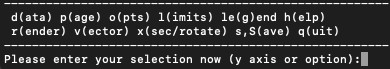

Options can be saved using the (s)ave option from the
menu:

   .. image:: figs/menu.png
      :width: 50.0%

.. _sec:menu-s:

(s)aving your settings
----------------------

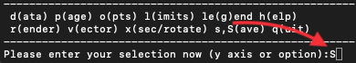

- Pressing ``s`` saves current options to ``splash.defaults``.

- Delete ``splash.defaults`` to revert all settings

- Pressing ``S`` saves both ``splash.defaults`` and ``splash.limits`` (and any other files).

- Typing ``sa`` or ``Sa`` gives a “save-as” option, changing the prefix of saved files

- read defaults files saved with a different prefix using the ``-p`` option

Example:

::

   Please enter your selection now (y axis or option):SA
   enter prefix for filenames: (default="blah"):
   default options saved to file blah.defaults
   saving plot limits to file blah.limits
   saving units to blah.units

Read this back using:

::

   splash -p blah

Files saved by splash can also be edited manually. For example,
``splash.limits`` is a simple two-column ascii file
containing minimum and maximum plot limits for each column.
To reset the plot limits simply delete the ``splash.limits`` file.

.. _sec:multiplot:

set (m)ultiplot
---------------

.. image:: figs/menu-m.png
   :width: 50.0%

.. _sec:multiplotsetup:

Plotting more than one column from the same file on the same page (multiplot)
~~~~~~~~~~~~~~~~~~~~~~~~~~~~~~~~~~~~~~~~~~~~~~~~~~~~~~~~~~~~~~~~~~~~~~~~~~~~~~

Press ’m’ (:ref:`sec:multiplot`) from the main menu to set up a multiplot.

Once you have gone through the options to set up a multiplot, to
actually plot what you have set simply type the number of the column
corresponding to “multiplot” at the :math:`y-`\ axis prompt.

.. important::
   A “multiplot” - multiple columns plotted from the same file - is
   different to plotting “multiple plots per page” - divide the plotting
   page up into panels. The number of panels across and down on a page can
   be changed (see :ref:`sec:nacrossndown`) irrespective of whether
   or not you are also plotting multiple columns from the same file.

Plotting each particle type in a different panel (multiplot)
~~~~~~~~~~~~~~~~~~~~~~~~~~~~~~~~~~~~~~~~~~~~~~~~~~~~~~~~~~~~~

To make a plot using different particle types in each panel (e.g. gas
density in one panel, dust or dark matter density in another), use ’m’
:ref:`sec:multiplot` from the main menu. If multiple types are present in
the data read, the option appears to specify the particular types you
want to use for each plot.

For example, after pressing ‘m’ at the main menu we eventually arrive at
the question:

::

   use all active particle types? (default=yes): n

Answering ``no`` brings up a possible list of types:

::

    1: use gas particles
    2: use ghost particles
    3: use sink particles
    4: use star particles
    5: use unknown/dead particles
   Enter type or list of types to use ([1:5], default=1): 1,3

Thus entering e.g. ``1,3`` specifies that only gas and sink particles
should be used for this plot.

.. important::
   This is more specific than simply turning particle types on
   and off for *all* plots, which can be achieved via the
   ``turn on/off particles by type`` option in the :ref:`sec:menu-o` (see
   :ref:`sec:plotparticlesbytype`).

.. _sec:menu-d:

(d)ata options
--------------

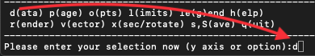

The following can all be achieved from the d)ata options menu:

Re-reading the initial data / changing the dump file
~~~~~~~~~~~~~~~~~~~~~~~~~~~~~~~~~~~~~~~~~~~~~~~~~~~~~
Just exit splash and restart
with the new dump file name on the command line (remember to save by
pressing ’S’ from the main menu before exiting to save both the current
settings and the plot limits – then you can continue plotting with the
current settings using a new dump file).

If you have placed more than one file on the command line, then pressing
space in :ref:`sec:interactive` will read (and plot) the next file (press ’h’
in :ref:`sec:interactive` for a full list of commands - you can move forwards
and backwards using arbitrary jumps). For non-interactive devices or
where :ref:`sec:interactive` is turned off dump files are cycled through
automatically, plotting the same plot for each file/timestep.

.. _sec:subsetofsteps:

Using only a subset of data files / plotting every :math:`n-`\ th dump file
~~~~~~~~~~~~~~~~~~~~~~~~~~~~~~~~~~~~~~~~~~~~~~~~~~~~~~~~~~~~~~~~~~~~~~~~~~~~
To plot a subset of the data files in \*any\* order, see :ref:`sec:selectedstepsonly`.

Of course, another way to achieve the same thing is to explicitly order
the files on the command line. A method I often use is to write all
filenames to a file, e.g.

::

   > ls DUMP* > splash.filenames

then edit the file to list only the files I want to use, then invoke
splash with no files on the command line:

::

   > splash

which will use the list of files specified in the ``splash.filenames``
file.

.. _sec:buffering:

Plotting more than one file without re-reading the data from disk
~~~~~~~~~~~~~~~~~~~~~~~~~~~~~~~~~~~~~~~~~~~~~~~~~~~~~~~~~~~~~~~~~~

For small data sets (or a small number of dump files) it is often useful
to read all of the data into memory so that you can move rapidly
forwards and backwards between dumps (e.g. in :ref:`sec:interactive`, or where
both dumps are plotted on the same page) without unnecessary re-reading
of data from disk. This is achieved with the command line flag::

  splash --buffer file_0*

(provided you have the memory of course!!). Non-buffered
data means that only one file at a time is read.

.. _sec:calc:

Calculating additional quantities not dumped
~~~~~~~~~~~~~~~~~~~~~~~~~~~~~~~~~~~~~~~~~~~~~

Turn ``calculate extra quantities`` on in the :ref:`sec:menu-d`.
New columns of data can be created as
completely arbitrary functions of the data read from the SPH particles.
Option ``d1`` in the data menu leads, for a typical data read, to a prompt
similar to the following:

::

    Specify a function to calculate from the data
    Valid variables are the column labels, 't', 'gamma', 'x0', 'y0' and 'z0' (origin setting)
    Spaces, escape sequences (\d) and units labels are removed from variable names
    Note that previously calculated quantities can be used in subsequent calculations

    Examples based on current data:
              r = sqrt((x-x0)**2 + (y-y0)**2 + (z-z0)**2)
              pressure = (gamma-1)*density*u
              |v| = sqrt(vx**2 + vy**2 + vz**2)

   Enter function string to calculate (blank for none) (default=""):

Thus, one can for example calculate the pressure from the density and
thermal energy according by copying the second example given.

.. hint::
   Function calculation is completely general and can use any of the
   columns read from the file, the time for each step (‘``t``’), the
   adiabatic index :math:`\gamma` (‘``gamma``’) and the current origin
   setting (``x0``, ``y0`` and ``z0``). Previously calculated quantities
   can also be used - e.g. in the above example we could further compute,
   say, an entropy variable using ``s=pressure/density^gamma`` after the
   pressure has been specified. The resultant quantities appear in the main
   splash menu as standard columns just as if they had been read from the
   original data file.

The origin for the calculation of radius can be changed via the
``rotation on/off/settings`` option in the :ref:`sec:menu-x`. If particle
tracking limits are set (see :ref:`sec:track`) the radius is
calculated relative to the particle being tracked.

If you simply want to multiply a column by a fixed number
(e.g. say you have sound speed squared and you want to plot temperature)
- this can also be achieved by defining a unit for the column (i.e., a
factor by which to multiply the column by) – see :ref:`sec:physicalunits` for details. The corresponding label
can be changed by creating a ``splash.columns`` file (or for the ascii
read just a file called ‘columns’) containing labels which are used to
override the default ones from the data read (one per line) – see
:ref:`sec:columnsfile` for more details.

See also :ref:`sec:geom` for how to transform vectors (and
positions) into different coordinate systems.

.. _sec:physicalunits:

Plotting data in physical units
~~~~~~~~~~~~~~~~~~~~~~~~~~~~~~~~

Data can be plotted in physical units by turning on the ``use physical
units`` option in the :ref:`sec:menu-d`. The settings for transforming the
data into physical units may be changed via the ``change physical unit
settings`` option in the :ref:`sec:menu-d`. (see :ref:`sec:changingunits`)

For some data reads (phantom, sphNG, magma) the scalings required to transform
the data into physical units are read from the dump file. These are used
as the default values but are overridden as soon as changes are made by
the user (that is, by the presence of a ‘splash.units’ file) (see
:ref:`sec:changingunits`).

.. important::
   Physical units are now ON by default in v3.x of SPLASH if they are set by the data read.
   You can use this option to revert to code units

Rescaling data columns
~~~~~~~~~~~~~~~~~~~~~~~

See :ref:`sec:physicalunits`.

.. _sec:columnsfile:

Changing the default column labels
~~~~~~~~~~~~~~~~~~~~~~~~~~~~~~~~~~~

The labelling of columns is usually automatic in the data format read
(for ascii files labels will be read from the file header). Aside from
changing the labels in the ``read_data`` file specific to the format you
are reading, it is also possible to override the labelling of columns at
runtime by creating a file called ``splash.columns`` (or with a
different prefix if the ``-p`` command line option is used), with one
label per line corresponding to each column read from the dump file,
e.g.

::

   column 1
   column 2
   column 3
   my quantity
   another quantity

.. warning::
   Labels in the ``splash.columns`` file *will not* override
   the labels of coordinate axes or labels for vector quantities (as these
   require the ability to be changed by plotting in different coordinate
   systems – see :ref:`sec:geom`).

Plotting column density in g/cm\ :math:`^{2}` without having x,y,z in cm
~~~~~~~~~~~~~~~~~~~~~~~~~~~~~~~~~~~~~~~~~~~~~~~~~~~~~~~~~~~~~~~~~~~~~~~~~

See :ref:`sec:changingunits`. In addition to units for each
column (and a unit for time – see :ref:`sec:timeunits`) a unit
can be set for the length scale added in 3D column integrated plots. The
prompt for this appears after the units of either :math:`x`, :math:`y`,
:math:`z` or :math:`h` has been changed via the ``change physical unit
settings`` option in the :ref:`sec:menu-d`. The length unit for integration is
saved in the first row of the splash.units file, after the units for
time.

See :ref:`sec:setprojlabel` for details on changing the
default labelling scheme for 3D column integrated (projection) plots.

.. _sec:changingunits:

Changing physical unit settings
~~~~~~~~~~~~~~~~~~~~~~~~~~~~~~~~

The settings for transforming the data into physical units may be
changed via the ``change physical unit settings`` option in the :ref:`sec:menu-d`.
To apply the physical units to the data select the ``use physical
units`` option in the :ref:`sec:menu-d`.

The transformation used is :math:`new= old*units` where ``old`` is the
data as read from the dump file and ``new`` is the value actually plotted.
The data menu option also prompts for a units label which is appended to
the usual label. Brackets and spaces should be explicitly included in
the label as required.

Once units have been changed, the user is prompted to save the unit
settings to a file called ``splash.units``. Another way of changing
units is simply to edit this file yourself in any text editor (the
format is fairly self-explanatory). To revert to the default unit
settings simply delete this file. To revert to code units turn ``use
physical units`` off in the :ref:`sec:menu-d`.

.. hint::
   A further example of where this option can be useful is where the
   :math:`y-`\ axis looks crowded because the numeric axis labels read
   something like :math:`1\times 10^{-4}`. The units option can be used to
   rescale the data so that the numeric label reads :math:`1` (by setting
   :math:`units=10^{4}`) whilst the label string is amended to read
   :math:`y
   [\times 10^{-4}]` by setting the units label to
   :math:`[ \times 10^{-4}]`.

Changing the axis label to something like :math:`x` :math:`[ \times 10^{4} ]`
~~~~~~~~~~~~~~~~~~~~~~~~~~~~~~~~~~~~~~~~~~~~~~~~~~~~~~~~~~~~~~~~~~~~~~~~~~~~~~

See :ref:`sec:changingunits`.

.. _sec:timeunits:

Changing the time units
~~~~~~~~~~~~~~~~~~~~~~~~

Units for the time used in the legend can be changed using the ``change
physical unit settings`` in the :ref:`sec:menu-d`. Changing the units of column
zero corresponds to the time (appears as the first row in the
‘splash.units’ file).

.. _sec:menu-i:

(i)nteractive mode
------------------

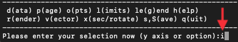

The menu option i) turns on/off :ref:`sec:interactive`. With this option turned
on (the default) and an appropriate device selected (i.e., the X-window,
not /png or /ps), after each plot the program waits for specific
commands from the user. With the cursor positioned anywhere in the plot
window (but not outside it!), many different commands can be invoked.
Some functions you may find useful are: Move through timesteps by
pressing ``space`` (``b`` to go back); zoom/select particles by
selecting an area with the mouse; rotate the particles by using the
:math:`<`, :math:`>`,[, ] and :math:`\backslash`, / keys; log the axes
by holding the cursor over the appropriate axis and pressing the ``l``
key. Press ``q`` in the plot window to quit :ref:`sec:interactive`.

A full list of these commands is obtained by holding the cursor in the
plot window and pressing the ‘h’ key (h for help).

.. hint::
   Changes made in :ref:`sec:interactive` will only be saved by pressing the ‘s’ (for
   save) key. Otherwise pressing ``space`` (to advance to the next
   timestep) erases the changes made during :ref:`sec:interactive`. A more
   limited :ref:`sec:interactive` applies when there is more than one plot per
   page.

Many more commands could be added to the :ref:`sec:interactive`, limited only
by your imagination. Please send me your suggestions!

Adapting the plot limits
~~~~~~~~~~~~~~~~~~~~~~~~~

Press ``a`` in :ref:`sec:interactive` to adapt the plot limits to the current
minimum and maximum of the quantity being plotted. With the mouse over
the colour bar, this applies to the colour bar limits. Also works even
when the page is subdivided into panels. To adapt the size of the arrows
on :ref:`sec:vectorplots`, press ``w``. To use “adaptive plot limits” (where the
limits change at every timestep), see :ref:`sec:adapt`.

Making the axes logarithmic
~~~~~~~~~~~~~~~~~~~~~~~~~~~~

Press ``l`` in :ref:`sec:interactive` with the mouse over either the x or y axis
or the colour bar to use a logarithmic axis. Pressing ``l`` again changes
back to linear axes. To use logarithmic labels as well as logarithmic
axes, see :ref:`sec:loglabels`.

Cycling through data columns interactively
~~~~~~~~~~~~~~~~~~~~~~~~~~~~~~~~~~~~~~~~~~

Use ``f`` in :ref:`sec:interactive` on :ref:`sec:renderplot` to interactively ‘flip’
forwards to the next quantity in the data columns (e.g. thermal energy
instead of density). Use ’F’ to flip backwards.

.. _sec:colourparts:

Colouring a subset of the particles and retaining this colour through other timesteps
~~~~~~~~~~~~~~~~~~~~~~~~~~~~~~~~~~~~~~~~~~~~~~~~~~~~~~~~~~~~~~~~~~~~~~~~~~~~~~~~~~~~~~

.. figure:: figs/colourparts.pdf
   :alt: coloured particles
   :name: fig:colourparts
   :width: 80.0%

   Example of particles coloured interactively using the mouse (left)
   and selection using a parameter range (right), which is the same as
   the plot on the left but showing only particles in a particular
   density range (after an intermediate plot of density vs x on which I
   selected a subset of particles and hit ``p``)

In :ref:`sec:interactive`, select a subset of the particles using the mouse
(that is left click and resize the box until it contains the region you
require), then press either 1-9 to colour the selected particles with
colours corresponding to plotting library colour indices 1-9, press ``p``
to plot only those particles selected (hiding all other particles), or
``h`` to hide the selected particles. An example is shown in the left
panel of :numref:`fig:colourparts`. Particles
retain these colours between timesteps and even between plots. This
feature can therefore be used to find particles within a certain
parameter range (e.g. by plotting density with x, selecting/colouring
particles in a given density range, then plotting x vs y in which the
particles will appear as previously selected/coloured). An example of
this feature is shown in the right panel of :numref:`fig:colourparts` where I have plotted
an intermediate plot of density vs x on which I selected a subset of
particles and hit ``p`` (to plot only that subset), then re-plotted x vs y
with the new particle selections.

To “un-hide” or “de-colour” particles, simply select the entire plotting
area and press ``1`` to restore all particles to the foreground colour
index.

Particles hidden in this manner are also no longer used in the rendering
calculation. Thus it is possible to render using only a subset of the
particles (e.g. using only half of a box, or only high density
particles). An example is shown in :numref:`fig:rendersubset`.

To colour the particles according to the value of a particular quantity,
see :ref:`sec:colournotrender`.

.. important::
   Selection in this way is based on the particle *identity*,
   meaning that the parameter range itself is not preserved for subsequent
   timesteps, but rather the subset of particles selected from the initial
   timestep. This can be useful for working out which particles formed a
   particular object in a simulation by selecting only particles in that
   object at the end time, and moving backwards through timesteps retaining
   that selection.

Working out which particles formed a particular object in a simulation
~~~~~~~~~~~~~~~~~~~~~~~~~~~~~~~~~~~~~~~~~~~~~~~~~~~~~~~~~~~~~~~~~~~~~~~

This can be achieved by selecting and colouring particles at a
particular timestep and plotting the same selection at an earlier time.
See :ref:`sec:colourparts` for details.

Plotting only a subset of the particles
~~~~~~~~~~~~~~~~~~~~~~~~~~~~~~~~~~~~~~~~

To turn plotting of certain particle *types* on and off, see
:ref:`sec:plotparticlesbytype`. To select a subset of the
particles based on restrictions of a particular parameter or by spatial
region see :ref:`sec:colourparts`.

.. _sec:rendersubset:

Rendering using only a subset of the particles
~~~~~~~~~~~~~~~~~~~~~~~~~~~~~~~~~~~~~~~~~~~~~~~

Particles can be selected and ‘hidden’ interactively (see
:ref:`sec:colourparts`) – for :ref:`sec:renderplot` ‘hidden’ particles
are also not used in the interpolation calculation from the particles to
the pixel array. An example is shown in :numref:`fig:rendersubset`, where I have taken
one of the rendered examples in :ref:`sec:basic`, selected half of
the domain with the mouse and pressed ’p’ to plot only the selected
particles. The result is the plot shown.

.. figure:: figs/rendersubset.pdf
   :alt: rendering with subset of particles
   :name: fig:rendersubset
   :width: 50.0%

   Example of :ref:`sec:renderplot` using only a subset of the particles. Here I
   have selected only particles on the right hand side of the plot using
   the mouse and hit ’p’ to plot only those particles.

.. important::
   Selection of data subsets is by default based on *particle identity* – the same particles will be used
   for the plot in subsequent dumps, allowing one to easily track the
   Lagrangian evolution of a patch of gas.
   See :ref:`sec:rangerestrict` to select by fixed parameter ranges
   (e.g. to only show particles in fixed density range).

.. hint::
   A range restriction can be set in :ref:`sec:interactive` by selecting
   the restricted box using the mouse and pressing ``x``, ``y`` or ``r`` to
   restrict the particles used to the x, y (or r for both x and y) range of
   the selected box respectively. Pressing ``S`` at the main menu will save
   such range restrictions to the ``splash.limits`` file.

Tracking a set of particles through multiple timesteps
~~~~~~~~~~~~~~~~~~~~~~~~~~~~~~~~~~~~~~~~~~~~~~~~~~~~~~~

See :ref:`sec:rendersubset`.

.. _sec:obliquexsec:

Taking an oblique cross section interactively
~~~~~~~~~~~~~~~~~~~~~~~~~~~~~~~~~~~~~~~~~~~~~~

It is possible to take an oblique :ref:`sec:xsec` through 3D data using a
combination of rotation and :ref:`sec:xsec` slice plotting. To set the
position interactively, press ``x`` in :ref:`sec:interactive` to draw the
position of the :ref:`sec:xsec` line (e.g. on an x-y plot this then
produces a z-x plot with the appropriate amount of rotation to give the
cross section slice in the position selected).

.. hint::
   Interactively selecting a :ref:`sec:xsec` will work
   even if the current plot is a 3D column integrated projection. In this
   case the setting ``projection or cross section`` changes to
   ``cross section`` in order to plot the slice.

.. _sec:menu-p:

(p)age options
--------------

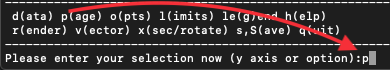

Options related to the page setup are changed in the p)age submenu.

.. _sec:nstepsontopofeachother:

Overlaying timesteps/multiple dump files on top of each other
~~~~~~~~~~~~~~~~~~~~~~~~~~~~~~~~~~~~~~~~~~~~~~~~~~~~~~~~~~~~~~

It is possible to over-plot data from one file on top of data from
another using the ``plot n steps on top of each other`` option from the
:ref:`sec:menu-p`. Setting :math:`n` to a number greater than one means that
the page is not changed until :math:`n` steps have been plotted.
Following the prompts, it is possible to change the colour of all
particles between steps and the graph markers used and plot an
associated legend (see below).

.. hint::
   This option can also be used in
   combination with a multiplot (see :ref:`sec:multiplot`) – for
   example plotting the density vs x and pressure vs x in separate panels,
   then with :math:`n > 1` all timesteps will be plotted in *each* panel.

When more than one timestep is plotted per page with different
markers/colours, an additional legend can be plotted (turn this on in
the :ref:`sec:menu-g`, or when prompted while setting the ``plot n steps
on top of each other`` option). The text for this legend is just the
filename by default, if one timestep per file, or just something dull
like ’step 1’, if more than one timestep per file.

.. hint::

   To change the legend text, create a file called ``splash.legend`` in the
   working directory, with one label per line. The position of the legend
   can be changed either manually via the ``legend and title options`` in the
   :ref:`sec:menu-p`, or by positioning the mouse in :ref:`sec:interactive` and
   pressing ``G`` (similar keys apply for moving plot titles and the legend
   for :ref:`sec:vectorplots` – press ``h`` in :ref:`sec:interactive` for a full list).

Plotting results from multiple files in the same panel
~~~~~~~~~~~~~~~~~~~~~~~~~~~~~~~~~~~~~~~~~~~~~~~~~~~~~~~

See :ref:`sec:nstepsontopofeachother`.

Plotting more than one dump file on the same page
~~~~~~~~~~~~~~~~~~~~~~~~~~~~~~~~~~~~~~~~~~~~~~~~~~

This is slightly different to “plotting more than one dump
file on the same panel”

.. _sec:axessettings:

Changing axes settings
~~~~~~~~~~~~~~~~~~~~~~~

Axes settings can be changed in the :ref:`sec:menu-p`, by choosing ``axes options``. The options are as follows:

::

    -4 : draw box and major tick marks only;
    -3 : draw box and tick marks (major and minor) only;
    -2 : draw no box, axes or labels;
    -1 : draw box only;
     0 : draw box and label it with coordinates;
     1 : same as AXIS=0, but also draw the coordinate axes (X=0, Y=0);
     2 : same as AXIS=1, but also draw grid lines at major increments of the coordinates;
     3 : draw box, ticks and numbers but no axes labels;
     4 : same as AXIS=0, but with a second y-axis scaled and labelled differently
    10 : draw box and label X-axis logarithmically;
    20 : draw box and label Y-axis logarithmically;
    30 : draw box and label both axes logarithmically.

Turning axes off
~~~~~~~~~~~~~~~~~

Plot axes can be turned off by choosing ``axes options`` in the :ref:`sec:menu-p`
or by deleting them using the backspace key in :ref:`sec:interactive`.
See :ref:`sec:axessettings` for more details.

Turning axes labels off
~~~~~~~~~~~~~~~~~~~~~~~~

Axes labels and numbering can be turned off via the ``axes options``
option in the :ref:`sec:menu-p` or by deleting them using the backspace key
in :ref:`sec:interactive`. See :ref:`sec:axessettings` for more
details.

.. _sec:loglabels:

Using logarithmic axes labels
~~~~~~~~~~~~~~~~~~~~~~~~~~~~~~

Logarithmic axes (that is where the quantity plotted is logged) can be
set via the ``apply log or inverse transformations`` option in the :ref:`sec:menu-l`
or simply by pressing ``l`` with the cursor over the desired axis
(or the colour bar) in :ref:`sec:interactive`. By default the axes labels
reads :math:`log(x)` and the number next to the axis is :math:`-4` when
:math:`x` is 10\ :math:`^{-4}`. Logarithmic axes labels (i.e., where the
label reads :math:`x` and the number next to the axis is :math:`10^{-4}`
with a logarithmic scale) can be specified by choosing the ``axes
options`` option in the :ref:`sec:menu-p` and setting the axes option to 10,
20 or 30 as necessary (see :ref:`sec:axessettings` for more
details).

Plotting a second, rescaled y-axis on the right hand side of a plot
~~~~~~~~~~~~~~~~~~~~~~~~~~~~~~~~~~~~~~~~~~~~~~~~~~~~~~~~~~~~~~~~~~~~

A second y axis can be added by selecting the axis=4 option in the ``axes option``
in the :ref:`sec:menu-p` (see :ref:`sec:axessettings`). This will prompt for
the scaling and alternative label:

::

   enter axis option ([-4:30], default=0): 4
   enter scale factor for alternative y axis ([0.000:], default=1.000): 10.0
   enter label for alternative y axis (default=""): y [other units]

.. _sec:papersize:

Changing the size of the plotting surface
~~~~~~~~~~~~~~~~~~~~~~~~~~~~~~~~~~~~~~~~~~

The physical size of the viewing surface used for plotting can be
changed via the ``change paper size`` option in the :ref:`sec:menu-p`. This
affects the size of the X-window (if plotted to the screen) and the size
of .png or images generated (if plotted to these devices). Several
preset options are provided or the paper size in x and y can be
explicitly specified in inches or pixels.

.. _sec:nacrossndown:

Dividing the plotting page into panels
~~~~~~~~~~~~~~~~~~~~~~~~~~~~~~~~~~~~~~~

The plotting page can be divided into panels using the ``subdivide page into panels``
option in the :ref:`sec:menu-p`. For multiple plots
per page (i.e., nacross :math:`\times` ndown :math:`> 1`) a more limited
:ref:`sec:interactive` applies (basically because the data used for the plots
is no longer stored in memory if there is more than one plot on the same
page meaning that functionality such as selecting particles must be
turned off).

.. _sec:tiling:

Tiling plots with the same :math:`x-` and :math:`y-` axes
~~~~~~~~~~~~~~~~~~~~~~~~~~~~~~~~~~~~~~~~~~~~~~~~~~~~~~~~~~

Plots with the same :math:`x-` and :math:`y-` axes are tiled if the
tiling option from the :ref:`sec:menu-p`. Tiling means that only one axis is shown where multiple plots
share the same x or y axis and that the plots are placed as close to
each other as possible. For :ref:`sec:renderplot` a shared colour bar is
plotted which spans the full length of the page.

.. _sec:squarexy:

Using non-proportional scales for spatial dimensions
~~~~~~~~~~~~~~~~~~~~~~~~~~~~~~~~~~~~~~~~~~~~~~~~~~~~~

By default if the x and y axes are both spatial coordinates, the axes
are scaled proportionately. This can be changed via the ``spatial
dimensions have same scale`` option in :ref:`sec:menu-p`.

Using non-square axes on coordinate plots
~~~~~~~~~~~~~~~~~~~~~~~~~~~~~~~~~~~~~~~~~~

See :ref:`sec:squarexy`.

Changing the character height for axes, labels and legends
~~~~~~~~~~~~~~~~~~~~~~~~~~~~~~~~~~~~~~~~~~~~~~~~~~~~~~~~~~~

The character height used for axes, labels and legends can be changed
via the :ref:`sec:menu-p`. The character height is
relative to the paper size where 1.0 = 1/40th of the page height.
The page height can be changed in :ref:`sec:papersize`.

Using a thicker line width on plots
~~~~~~~~~~~~~~~~~~~~~~~~~~~~~~~~~~~~

The line width used for axes and text can be changed via the :ref:`sec:menu-p`.

.. _sec:pagecolours:

Changing the foreground and background colours
~~~~~~~~~~~~~~~~~~~~~~~~~~~~~~~~~~~~~~~~~~~~~~~

The background and foreground colour of a plot can be changed via the
``set foreground/background colours`` option in the :ref:`sec:menu-p`. Note
that the background colour setting has no effect on postscript devices
(see :ref:`sec:postscript` for more details).

Plotting axes, legends and titles in white even when the labels are plotted in black
~~~~~~~~~~~~~~~~~~~~~~~~~~~~~~~~~~~~~~~~~~~~~~~~~~~~~~~~~~~~~~~~~~~~~~~~~~~~~~~~~~~~~

By default, axes, legends and titles are plotted in the foreground
colour (e.g. black). However if the plot itself is also largely black
(e.g. :ref:`sec:renderplot` when lots of particles are plotted) it can be
useful to overplot those parts of the axes and labelling which lie on
top of the plotting surface in the background colour (e.g. white). A
prompt for this is given when setting the ``set foreground/background
colours`` option in the :ref:`sec:menu-p`.

The prompt appears as follows:

::

   ---------------- page setup options -------------------
   ...
    9) set foreground/background colours
   enter option ([0:8], default=0):9
    Enter background colour (by name, e.g. "black") (default=""):white
    Enter foreground colour (by name, e.g. "white") (default=""):black

    Overlaid (that is, drawn inside the plot borders) axis
    ticks, legend text and titles are by default plotted in
    the foreground colour [i.e., black].

   Do you want to plot these in background colour [i.e., white] instead ? (default=no):y

In the above I have selected a background colour of white, a foreground
colour of black. Answering yes to the last question means that those
parts of the axes which lie on top of the viewing surface (and any
labels) will be plotted in white (the background colour) instead of the
foreground colour (black).

.. _sec:menu-g:

le(g)end and title options
--------------------------

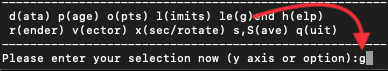

.. _sec:title:

Adding titles to plots / repositioning titles
~~~~~~~~~~~~~~~~~~~~~~~~~~~~~~~~~~~~~~~~~~~~~~

Plots may be titled individually by creating a file called
``splash.titles`` in the current directory, with the title on each line
corresponding to the position of the plot on the page. Thus the title is
the same between timesteps unless the steps are plotted together on the
same physical page. Leave blank lines for plots without titles. For
example, creating a file called ``splash.titles`` in the current
directory, containing the text:

::

   plot one
   plot two
   plot three

and positioning the title using the default options, will produce a plot
with one of these titles on each panel.

.. _sec:legendoff:

Turning off/moving the time legend
~~~~~~~~~~~~~~~~~~~~~~~~~~~~~~~~~~~

The position of the time legend can be set interactively by positioning
the mouse in the plot window and pressing ’G’. To set the position
non-interactively and/or change additional settings such as the
justification, use the ``time legend on/off/settings`` option in the
:ref:`sec:menu-g`.

.. _sec:timelegendtext:

Changing the text in the time legend
~~~~~~~~~~~~~~~~~~~~~~~~~~~~~~~~~~~~~

The text which appears the time legend (by default this is ``t=``) can be
changed via the ``time legend on/off/settings`` option in the :ref:`sec:menu-g`.

To rescale the *value* of the time displayed in the time legend (default
value is as read from the dump file), see
:ref:`sec:timeunits`.

Making the legend read 'z=' instead of 't='
~~~~~~~~~~~~~~~~~~~~~~~~~~~~~~~~~~~~~~~~~~~~

See :ref:`sec:timelegendtext`. An option to change the legend text
is provided in the ``time legend on/off/settings`` option in :ref:`sec:menu-g`.
The numeric value of the time legend is as read into the
``time`` array in the read_data routine. This value can be rescaled by
setting a unit for time (see :ref:`sec:timeunits`).

Plotting the time legend on the first row/column of panels / nth panel only
~~~~~~~~~~~~~~~~~~~~~~~~~~~~~~~~~~~~~~~~~~~~~~~~~~~~~~~~~~~~~~~~~~~~~~~~~~~~

An option to plot the time legend on the first row or column of panels
or on a single panel only appears in the :ref:`sec:menu-g`.

Plotting a length scale on coordinate plots
~~~~~~~~~~~~~~~~~~~~~~~~~~~~~~~~~~~~~~~~~~~~

An option to plot a length scale (i.e., ``|---|`` with a label below it
indicating the length) on coordinate plots (i.e., plots where both
:math:`x-` and :math:`y-`\ axes refer to particle coordinates) is
provided in the :ref:`sec:menu-g`.

Annotating a plot with squares, rectangles, arrows, circles and text
~~~~~~~~~~~~~~~~~~~~~~~~~~~~~~~~~~~~~~~~~~~~~~~~~~~~~~~~~~~~~~~~~~~~~

Use the ``annotate plot`` option in :ref:`sec:menu-g` to annotate plots
with a range of geometric objects (squares, rectangles, arrows, circles
and text) with full control over attributes such as line width, line
style, colour, angle and fill style.

Text annotation can also be added/deleted in :ref:`sec:interactive` using
``ctrl-t`` (to add) and the backspace key (to delete). Text can also be
added to plots by adding titles (:ref:`sec:title`) which can be
different in different panels. Text labels added using shape annotation
differ from titles by the fact that they must appear the same in each
panel and are positioned according to the world co-ordinates of the plot
(rather than relative to the viewport). Shape text can also be displayed
at arbitrary angles.

An option to plot length scales (``|---|``) on coordinate plots is
implemented separately via the ``plot scale on coordinate plots`` option
in :ref:`sec:menu-g`.

Adding your name to a plot/movie
~~~~~~~~~~~~~~~~~~~~~~~~~~~~~~~~~

Arbitrary text annotation can be added/removed in :ref:`sec:interactive` using
``ctrl-t`` (to add) and the backspace key (to delete) or via the
``annotate plot`` option in the :ref:`sec:menu-g`.

.. _sec:menu-o:

particle plot (o)ptions
-----------------------

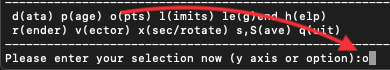

The following are tasks which can be achieved via options in the :ref:`sec:menu-o`.

.. _sec:plotparticlesbytype:

Plotting non-gas particles (e.g. ghosts, boundary, sink particles)
~~~~~~~~~~~~~~~~~~~~~~~~~~~~~~~~~~~~~~~~~~~~~~~~~~~~~~~~~~~~~~~~~~~

Particles of different types can be turned on or off (i.e., plotted or
not) using the ``turn on/off particles by type`` option in :ref:`sec:menu-o`.
This option also prompts to allow particles of
non-SPH types to be plotted on top of :ref:`sec:renderplot` (useful for sink or
star particles - this option does not apply to SPH particle types).
Turning SPH particle types on or off also determines whether or not they
will be used in the rendering calculation (i.e., the interpolation to
pixels). This particularly applies to ghost particles, where ghost
particles will only be used in the rendering if they are turned on via
this menu option.

(The fact that particles of a given type are SPH particles or not is
specified by the ``UseTypeInRendering`` flags in the set_labels part of
the read_data file).

Plotting non-gas particles on top of rendered plots
~~~~~~~~~~~~~~~~~~~~~~~~~~~~~~~~~~~~~~~~~~~~~~~~~~~~

An option to plot non-SPH particles on top of :ref:`sec:renderplot` (e.g. sink
particles) can be set when turning particle types on/off via the
``turn on/off particles by type`` option in :ref:`sec:menu-o`
(see :ref:`sec:plotparticlesbytype`).

Using ghost particles in the rendering
~~~~~~~~~~~~~~~~~~~~~~~~~~~~~~~~~~~~~~~

See :ref:`sec:plotparticlesbytype`.

Turn off plotting of gas particles
~~~~~~~~~~~~~~~~~~~~~~~~~~~~~~~~~~~

Particles can be turned on or off by type via the
``turn on/off particles by type`` option in :ref:`sec:menu-o`. See
:ref:`sec:plotparticlesbytype`.

.. _sec:darkmatter:

Plotting dark matter particles
~~~~~~~~~~~~~~~~~~~~~~~~~~~~~~~

To plot dark matter particles (e.g. for the gadget read) the particle
type corresponding to dark matter particles must be turned on via the
``turn on/off particles by type`` option in :ref:`sec:menu-o`. Turning this
option on means that dark matter particles will appear on particle
plots.

To make :ref:`sec:renderplot` of dark matter (e.g. showing column density), it
is necessary to define smoothing lengths and a fake “density” for the
dark matter particles. If your data read already supplies individual
smoothing lengths for dark matter particles, the only thing to do is
define a fake density field with a constant value (e.g. :math:`\rho = 1`
for all dark matter particles). The actual density value does not
matter, so long as it is non-zero, as the rendering for density does not
use it unless the ``normalise interpolations`` option in the :ref:`sec:menu-r`
is set (which it is not by default). This is because SPLASH constructs
the weight:

.. math:: w_{part} = \frac{m_{part}}{\rho_{part} h_{part}^{\nu}},

(see `Price 2007 <https://ui.adsabs.harvard.edu/abs/2007PASA...24..159P>`_) and then interpolates for any
quantity A using

.. math:: A_{pixels} = \sum_{part} w_{part} A_{part} W_{kernel},

so if :math:`A = \rho` then the actual rho value cancels.

For the GADGET data read you can define the smoothing length for dark
matter particles by setting the environment variable
GSPLASH_DARKMATTER_HSOFT (see :ref:`sec:gsplash` for details),
which also triggers the creation of a fake density column as required.
With this variable set dark matter particles are treated identically to
SPH particles and can be rendered as usual (although the only meaningful
quantity to render is the density). A much better way is to define
smoothing lengths individually for dark matter particles, for example
based on a local number density estimate from the relation

.. math:: h \propto n^{-1/3}, \hspace{0.5cm} \textrm{where} \hspace{0.5cm} n_{i} = \sum_{j} W_{ij}.

Actually, none of this should be necessary, as the gravity for dark
matter should be softened with smoothing lengths defined like this in
the first place. The historical practice of fixed softening lengths has
arisen only because of confusion about what softening really means (and
worries about energy conservation with adaptive softening lengths). What
you are trying to do is solve Poisson’s equation for the dark matter
density field, defined with a kernel density estimate and using fixed
softening lengths is not a way to get a good density... but don’t get me
started, read [PM07]_ instead.

.. danger::
   For simulations using both SPH and dark matter particles, dark
   matter particles will contribute (incorrectly) to the SPH rendering when
   the environment variable is set and the plotting of dark matter
   particles is turned on. Thus to plot just gas column density in this
   case, dark matter particles must be turned off [via the :ref:`sec:menu-o`],
   and similarly to plot just dark matter density if both SPH and dark
   matter particles are present, SPH particles must be turned off.

Plotting a column density plot of dark matter/N-body particles
~~~~~~~~~~~~~~~~~~~~~~~~~~~~~~~~~~~~~~~~~~~~~~~~~~~~~~~~~~~~~~~

See :ref:`sec:darkmatter`.

.. _sec:plotsinks:

Plotting sink particles
~~~~~~~~~~~~~~~~~~~~~~~~

Sink particles will be plotted on particle plots once turned on via the
``turn on/off particles by type`` option in :ref:`sec:menu-o`.
Setting this option also gives a prompt for whether or not to
plot sink particles on top of :ref:`sec:renderplot` (to which the answer should
be yes). See :ref:`sec:plotparticlesbytype` for more details.

To plot sink particles as a circle scaled to the sink radius, select the
appropriate marker type (32-35) in the ``change graph markers for each
type`` option in :ref:`sec:menu-o`. This allows plotting of particles of a
given type with circles, filled or open, proportional to their smoothing
lengths. Thus, the smoothing length for sink particles needs to be set
to their accretion radius (or at least proportional to it).

.. hint::
   A good option for sink particles is to print “outlined” filled
   circles (marker 34) — these show up on both black or white backgrounds.

Plotting sink particles with size proportional to the sink radius
~~~~~~~~~~~~~~~~~~~~~~~~~~~~~~~~~~~~~~~~~~~~~~~~~~~~~~~~~~~~~~~~~~

See :ref:`sec:plotsinks`.

Plotting a point mass particle with physical size
~~~~~~~~~~~~~~~~~~~~~~~~~~~~~~~~~~~~~~~~~~~~~~~~~~

See :ref:`sec:plotsinks`.

Changing graph markers for each particle type
~~~~~~~~~~~~~~~~~~~~~~~~~~~~~~~~~~~~~~~~~~~~~~

The graph markers used to plot each particle type can be changed via the
``change graph markers for each type`` option in the :ref:`sec:menu-o`. The full list of available markers is given in the
documentation for giza (also similar to the markers used in pgplot).

SPLASH also allows the particles to be marked by a circle proportional
to the smoothing length for that particle, implemented as marker types
32-35 under the ``change graph markers for each type`` option in the :ref:`sec:menu-o`.

.. _sec:partcolours:

Plotting each particle type in a different colour
~~~~~~~~~~~~~~~~~~~~~~~~~~~~~~~~~~~~~~~~~~~~~~~~~~

Each particle type can be plotted in a different colour via the ``set
colour for each particle type`` option in the :ref:`sec:menu-o`.

Changing the order in which different particle types are plotted
~~~~~~~~~~~~~~~~~~~~~~~~~~~~~~~~~~~~~~~~~~~~~~~~~~~~~~~~~~~~~~~~~

The order in which particle types are plotted can be changed via the
``change plotting order of types`` option in :ref:`sec:menu-o`.
For example, it is possible to make dark matter particles
be plotted on top of gas particles rather than the default which is
vice-versa. This is only implemented for particle
types which are stored contiguously (one after the other) in the data
read, rather than mixed in with each other.

.. _sec:lines:

Plotting using lines instead of dots (e.g. for energy vs time plots)
~~~~~~~~~~~~~~~~~~~~~~~~~~~~~~~~~~~~~~~~~~~~~~~~~~~~~~~~~~~~~~~~~~~~~

An option to plot a line joining all of the points on a plot can be set
via the ``plot line joining particles`` option in :ref:`sec:menu-o`.
When set, this option plots a line connecting the (gas
only) particles in the order that they appear in the data array. Useful
mainly in one dimension or when plotting ascii data, although can give
an indication of the relative closeness of the particles in memory and
in physical space in higher dimensions. The line colours and styles can
be changed.

To plot the line only with no particles, turn off gas particles using
the ``turn on/off particles by type option`` from :ref:`sec:menu-o`.

Plotting multiple lines with different colours/line styles and a legend
~~~~~~~~~~~~~~~~~~~~~~~~~~~~~~~~~~~~~~~~~~~~~~~~~~~~~~~~~~~~~~~~~~~~~~~~

When multiple timesteps are plotted on the same physical page, the line
style can be changed instead of the colour (this occurs when the change
colour option is chosen for multiple steps per page – see the
``change plots per page`` option in the :ref:`sec:menu-p`.

Joining the dots
~~~~~~~~~~~~~~~~~

See :ref:`sec:lines`.

.. _sec:smoothingcircle:

Plotting the size of the smoothing circle around selected particles
~~~~~~~~~~~~~~~~~~~~~~~~~~~~~~~~~~~~~~~~~~~~~~~~~~~~~~~~~~~~~~~~~~~~

On coordinate plots this option plots a circle of radius :math:`2h`
around selected particles. This is primarily useful in debugging
neighbour finding routines. Where only one of the axes is a coordinate
this function plots an error bar of length :math:`2h` in either
direction is plotted in the direction of the coordinate axis. See also
:ref:`sec:findingaparticle` for more details.

.. _sec:findingaparticle:

Locating a particular particle in the data set
~~~~~~~~~~~~~~~~~~~~~~~~~~~~~~~~~~~~~~~~~~~~~~~

The best way to locate a particular particle in the data set is to use
the ``plot smoothing circles`` option in :ref:`sec:menu-o`, e.g:

::

   Please enter your selection now (y axis or option):o5
   ------------- particle plot options -------------------
    Note that circles of interaction can also be set interactively
   Enter number of circles to draw ([0:100], default=0):1
   Enter particle number to plot circle around ([1:959], default=1): 868

then upon plotting a coordinate plot (e.g. x vs y), particle 868 will be
plotted with a circle of size :math:`2h` which makes it easy to
distinguish from the other particles. See also
:ref:`sec:smoothingcircle`.

.. _sec:geom:

Plotting in different coordinate systems (e.g. cylindrical coordinates)
~~~~~~~~~~~~~~~~~~~~~~~~~~~~~~~~~~~~~~~~~~~~~~~~~~~~~~~~~~~~~~~~~~~~~~~~

The coordinates of position and of all vector components can be
transformed into non-cartesian coordinate systems using the
``change coordinate system`` option in :ref:`sec:menu-o`. For
example, a dump file with columns as follows:

::

   -------------------------------------------------------
     1) x                     6) log density
     2) y                     7) v\dx
     3) z                     8) v\dy
     4) particle mass         9) v\dz
     5) h
   -------------------------------------------------------
    10) multiplot [  4 ]      m) set multiplot
   -------------------------------------------------------
   Please enter your selection now (y axis or option):

choosing :ref:`sec:menu-o`, option 7) and choosing cylindrical coordinates then
produces;

::

    You may choose from a delectable sample of plots
   -------------------------------------------------------
     1) r                     6) log density
     2) phi                   7) v\dr
     3) z                     8) v\dphi
     4) particle mass         9) v\dz
     5) h
   -------------------------------------------------------
   ...

transforming both coordinates and vectors into the chosen coordinate
system.

.. hint::
   :ref:`sec:renderplot` are also possible in coordinate systems other than
   those native to the file.

.. hint::
   For 3D SPH simulations, extra columns will appear in the menu in cylindrical
   or spherical coordinates allowing plots of azimuthally-averaged surface
   density and Toomre Q parameter. For more details see :ref:`sec:surfdens`.

Details of the coordinate transformations are given in
:ref:`sec:coordtransforms`.

If you have a coordinate system you would like implemented, please email
me the details!

Plotting vector components in different coordinate systems
~~~~~~~~~~~~~~~~~~~~~~~~~~~~~~~~~~~~~~~~~~~~~~~~~~~~~~~~~~~

See :ref:`sec:geom`.

Plotting orbital velocities
~~~~~~~~~~~~~~~~~~~~~~~~~~~~

See :ref:`sec:geom`.

Plotting against azimuthal angle/cylindrical radius/etc
~~~~~~~~~~~~~~~~~~~~~~~~~~~~~~~~~~~~~~~~~~~~~~~~~~~~~~~~

See :ref:`sec:geom`.

.. _sec:exactsolns:

Plotting the exact solution to common test problems
~~~~~~~~~~~~~~~~~~~~~~~~~~~~~~~~~~~~~~~~~~~~~~~~~~~~
Turn on `plot exact solution` in :ref:`sec:menu-o`

The following exact solutions are provided

-  Any arbitrary function y = f(x,t) (can be plotted on any or all of
   the plots). The functions to be plotted can also be specified by
   creating a ``splash.func`` file with one function per line.

-  Hydrodynamic shock tubes (Riemann problem) – a full solution is
   provided for all types of waves propagating in either direction.

-  Spherically-symmetric 3D sedov blast wave problem.

-  Polytropes (with arbitrary :math:`\gamma`)

-  One and two dimensional toy stars. This is a particularly simple test
   problem for SPH codes described in [MP04]_.

-  Linear wave. This simply plots a sine wave of a specified amplitude,
   period and wavelength on the plot specified.

-  MHD shock tubes (tabulated). These are tabulated solutions for 7
   specific MHD shock tube problems.

-  h vs :math:`\rho`. This is the exact solution relating smoothing
   length and density in the form :math:`h \propto (m/\rho)^{1/\nu}`
   where :math:`\nu` is the number of spatial dimensions.

-  radial density profiles. For various models commonly used in
   :math:`N-`\ body simulations.

-  Exact solution from a file. This option reads in an exact solution
   from the filename input by the user, assuming the file contains two
   columns containing the :math:`x-` and :math:`y-` coordinates of an
   exact solution to be plotted as a line on the plot specified.

Details of the calculation of the exact solutions are given in
:ref:`sec:exact`. An example plot using the Sedov blast
wave exact solution is shown in :numref:`fig:sedov`.

.. figure:: figs/sedov_example.png
   :alt: sedov exact solution
   :name: fig:sedov
   :width: 50.0%

   Example of a plot utilising the Sedov blast wave exact solution.
   Taken from [RP07]_.

Plotting an exact solution from a file
~~~~~~~~~~~~~~~~~~~~~~~~~~~~~~~~~~~~~~~

See :ref:`sec:exactsolns`. One of the options for exact
solution plotting is to read the exact solution from either one or a
sequence of ascii files, such that the results are plotted alongside the
particle data. The filename(s) can be specified by the user and will be
saved to the ‘splash.defaults’ file so that the solution(s) will be read
and plotted on subsequent invocations of splash .

Changing the exact solution line style & colour
~~~~~~~~~~~~~~~~~~~~~~~~~~~~~~~~~~~~~~~~~~~~~~~~

The line style and colour of the exact solution line can be changed via
the ``exact solution plot options`` option in :ref:`sec:menu-o`. This option
can also be used to turn on/off calculation of various error norms
together with an inset plot of the residual error on the particles. See
:ref:`sec:exact` for details of the error norms
calculated.

Setting the number of points used in an exact solution calculation
~~~~~~~~~~~~~~~~~~~~~~~~~~~~~~~~~~~~~~~~~~~~~~~~~~~~~~~~~~~~~~~~~~~

The number of points used in an exact solution calculation can be
changed via the ``exact solution plot options`` option in :ref:`sec:menu-o`.

Plotting an inset plot of residual errors from an exact solution
~~~~~~~~~~~~~~~~~~~~~~~~~~~~~~~~~~~~~~~~~~~~~~~~~~~~~~~~~~~~~~~~~

An inset plot of residual errors between the plotted points and an exact
solution calculation can be turned on via the
``exact solution plot options`` option in :ref:`sec:menu-o`.

.. _sec:menu-l:

(l)imits menu
-------------

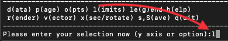

.. _sec:adapt:

Using plot limits which adapt automatically for each new plot
~~~~~~~~~~~~~~~~~~~~~~~~~~~~~~~~~~~~~~~~~~~~~~~~~~~~~~~~~~~~~~

Adaptive plot limits can be set using option 1 of the :ref:`sec:menu-l`.
Different settings can be applied to coordinate axes and non-coordinate axes. Changing
plot limits interactively and pressing ``s`` in :ref:`sec:interactive` will
change this option back to using fixed limits.

Using adaptive plot limits for the colour bar but not for the coordinates
~~~~~~~~~~~~~~~~~~~~~~~~~~~~~~~~~~~~~~~~~~~~~~~~~~~~~~~~~~~~~~~~~~~~~~~~~~

Adaptive plot limits can be set individually for coordinate axes and
non-coordinate axes (e.g. the colour bar) via the
``use adaptive/fixed limits`` option in the :ref:`sec:menu-l`. See :ref:`sec:adapt`.

Setting plot limits manually
~~~~~~~~~~~~~~~~~~~~~~~~~~~~~

Plot limits can be set manually using option 2) of the :ref:`sec:menu-l` (or
simply ``l2`` from the main menu). Alternatively you can edit the
``splash.limits`` file created by :ref:`sec:menu-s` prior to
invoking splash (this file simply contains the minimum and maximum
limits for each column on consecutive lines).

.. _sec:track:

Making plot limits relative to a particular particle
~~~~~~~~~~~~~~~~~~~~~~~~~~~~~~~~~~~~~~~~~~~~~~~~~~~~~

Particle tracking limits (i.e., where a chosen particle is always at the
centre of the plot and limits are set relative to that position) can be
set via the ``make xy limits relative to particle`` option in the :ref:`sec:menu-l`.
Alternatively particle tracking limits can be set interactively by
pressing ``t`` in :ref:`sec:interactive` with the cursor over the particle you
wish to track.

.. warning::
   This option only works if particle identities
   are preserved between timesteps in the data files

.. important::
   With particle tracking limits set, the radius calculated via
   the ``calculate extra quantities`` option in the :ref:`sec:menu-d`
   is calculated relative to the tracked particle.

Centreing on a sink particle can also be achieved using the
SPLASH_CENTRE_ON_SINK environment variable (see :ref:`sec:envvariables`).

Plotting in a comoving reference frame
~~~~~~~~~~~~~~~~~~~~~~~~~~~~~~~~~~~~~~~

A co-moving reference frame can be set using the
``make xy limits relative to particle`` option in the :ref:`sec:menu-l`. Coordinate limits are
then centred on the selected particle for all timesteps, with offsets as
input by the user. This effectively gives the ‘Lagrangian’ perspective.
See :ref:`sec:track` for more details. Centreing on a sink
particle can also be achieved using the SPLASH_CENTRE_ON_SINK
environment variable.

Setting the origin to correspond to a particular particle
~~~~~~~~~~~~~~~~~~~~~~~~~~~~~~~~~~~~~~~~~~~~~~~~~~~~~~~~~~

See :ref:`sec:track`.

Tracking a particle
~~~~~~~~~~~~~~~~~~~~

See :ref:`sec:track`.

.. _sec:tracksink:

Setting the origin to the position of the :math:`n`\ th sink particle
~~~~~~~~~~~~~~~~~~~~~~~~~~~~~~~~~~~~~~~~~~~~~~~~~~~~~~~~~~~~~~~~~~~~~~

This can be achieved using the ``make xy limits relative to particle``
option in the :ref:`sec:menu-l`. For example, to track the first sink
particle we would proceed as follows:

::

   Please enter your selection now (y axis or option):l3
   ------------------ limits options ---------------------
   To track particle 4923, enter 4923
   To track the 43rd particle of type 3, enter 3:43

   Enter particle to track: (default="0"): 3:1

where 3:1 indicates the first particle of type 3. The origin is set to
the position of this particle and limits are relative to its position.
See :ref:`sec:track` for more details.

Plotting radial plots around sink particles
~~~~~~~~~~~~~~~~~~~~~~~~~~~~~~~~~~~~~~~~~~~~

First, set the origin to the location of the sink, as described above.
Then simply change to spherical coordinates using the ``change coordinate systems``
option in :ref:`sec:menu-o`. Alternatively, compute the radius using
the ``calculate extra quantities`` option in the :ref:`sec:menu-d`.

Automatically adapting plot limits to match aspect ratio of output device
~~~~~~~~~~~~~~~~~~~~~~~~~~~~~~~~~~~~~~~~~~~~~~~~~~~~~~~~~~~~~~~~~~~~~~~~~~

An option to automatically adjust the plot limits to match the aspect
ratio of the output device is given in the :ref:`sec:menu-l`, and is also
prompted for whenever the paper size is changed (via the ``change paper
size`` option in the :ref:`sec:menu-p`, see :ref:`sec:papersize`).

Plotting with log axes.
~~~~~~~~~~~~~~~~~~~~~~~~

Log axes can be set either interactively (by pressing ``l`` with the
cursor over the desired axis) or manually via the ``apply log or inverse
transformations to columns`` option in the :ref:`sec:menu-l`. To use
logarithmic axes labels as well, see :ref:`sec:loglabels`.

Plotting the square root, inverse or square of a quantity
~~~~~~~~~~~~~~~~~~~~~~~~~~~~~~~~~~~~~~~~~~~~~~~~~~~~~~~~~~

Columns can be logged, inverted, sqrt-ed, squared or any combination of
the above via the ``apply log or inverse transformations to columns``
option in the :ref:`sec:menu-l`. If you have any additional transformations
you would find useful please let me know, as it is straightforward to
add more.

.. _sec:resetlimits:

Resetting limits for all columns
~~~~~~~~~~~~~~~~~~~~~~~~~~~~~~~~~

Limits for all columns can be reset to their minimum and maximum values
from the current dump file via the ``reset limits for all columns`` option
in the :ref:`sec:menu-l`. See :ref:`sec:interactive` for details of
resetting plot limits for a particular plot interactively.

Restoring all plot limits to their minimum and maximum values in the current dump file
~~~~~~~~~~~~~~~~~~~~~~~~~~~~~~~~~~~~~~~~~~~~~~~~~~~~~~~~~~~~~~~~~~~~~~~~~~~~~~~~~~~~~~~

See :ref:`sec:resetlimits`.

.. _sec:rangerestrict:

Using a subset of data restricted by parameter range
~~~~~~~~~~~~~~~~~~~~~~~~~~~~~~~~~~~~~~~~~~~~~~~~~~~~~

You can use only a subset of the
particles in both particle plots and :ref:`sec:renderplot`, according to
restrictions on any or all of the data columns (for example, using only
particles with :math:`\rho > 10`, in the 3D box
:math:`x,y,z  \in [-0.1, 0.1]`). Whilst this has always been possible by
selecting, colouring and/or hiding particles in :ref:`sec:interactive` (see
:ref:`sec:rendersubset`), the difference here is that the
selection is based, for each timestep, strictly on the parameter range,
rather than being a selection based on particle identity. This means
that the parameter range is also saved to the ``splash.limits`` (i.e.,
by :ref:`sec:menu-s`) and is shown when splash launches
via lines such as:

::

   >> current range restrictions set:

    (  1.693E-01 < x <  1.820E-01 )
    (  2.205E-01 < y <  2.265E-01 )
    (  7.580E-06 < density <  2.989E-05 )

   >> only particles within this range will be plotted
      and/or used in interpolation routines

or more usually:

::

   >> no current parameter range restrictions set

Parameter range restrictions can be set either manually via the :ref:`sec:menu-l`
(option 7) or interactively by selecting a region in the plot and
pressing ‘x’, ‘y’ or ‘r’ to restrict using the :math:`x`, :math:`y` or
both :math:`x` and :math:`y` limits of the selected area respectively
(pressing ‘R’ instead removes all currently set restrictions). Another
way of setting manual range restrictions is simply to edit the
``splash.limits`` file directly (this simply contains the min and max
limits for each column, followed optionally by a third and fourth column
specifying, respectively, the min and max of the range restriction).

Plotting only particles with :math:`\rho > 10`, :math:`u > 20` and :math:`-0.25 < x < 0.25`
~~~~~~~~~~~~~~~~~~~~~~~~~~~~~~~~~~~~~~~~~~~~~~~~~~~~~~~~~~~~~~~~~~~~~~~~~~~~~~~~~~~~~~~~~~~~

Plotting a subset of the particles restricted by a parameter can be
achieved by setting a parameter range restriction (which does not change
between timesteps – see :ref:`sec:rangerestrict`), or
alternatively by an interactive selection based on particle identity
(see :ref:`sec:rendersubset`).

.. _sec:menu-r:

(r)endering options
-------------------

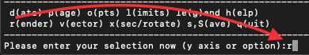

Changing the number of pixels in a rendered image
~~~~~~~~~~~~~~~~~~~~~~~~~~~~~~~~~~~~~~~~~~~~~~~~~~

The number of pixels in a rendered image can be set manually using the
:ref:`sec:menu-r`, option 1 (or simply type ``r1`` from the main menu). The
number set is the number of pixels along the :math:`x-`\ axis. The
number of pixels along the :math:`y-`\ axis is determined by the aspect
ratio of the plot.

The number of pixels used in an image is, by
default, automatically determined by the actual number of pixels
available on the graphics device, which depends in turn on the size of
the page (the page size can be set manually in the :ref:`sec:menu-p` – see
:ref:`sec:papersize`). For vector
(non-pixel) devices such as postscript, svg or pdf, the number of pixels
is set to :math:`1024/\textrm{n}`, where n is the number of panels
across the page.

Changing the colour scheme
~~~~~~~~~~~~~~~~~~~~~~~~~~~

The colour scheme used for :ref:`sec:renderplot` can be changed either by
pressing ``m`` or ``M`` in :ref:`sec:interactive` to cycle through the available
schemes or manually by using the ``change colour scheme`` option in the
:ref:`sec:menu-r`.

A demonstration of all the colour schemes can be also be invoked from
this menu option. Setting the colour scheme to zero plots only the
contours of the rendered quantity (assuming that plot contours is set to
true). The colour schemes available are shown in :numref:`fig:colourschemes`.

.. figure:: figs/colourschemes.pdf
   :alt: splash colour schemes
   :name: fig:colourschemes

   splash colour schemes

User contributed colour schemes are eagerly invited (just send me
either: a table of r,g,b colour indices [if you know them] or just an
image of a colour bar you wish to reproduce and I will add it).

Plotting contours as well as the rendered image
~~~~~~~~~~~~~~~~~~~~~~~~~~~~~~~~~~~~~~~~~~~~~~~~

Contours of either the rendered pixel array or of another (separate)
quantity can be plotted on top of :ref:`sec:renderplot` by setting the
``plot contours`` option from the :ref:`sec:menu-r`. With this option set, an extra
prompt will appear after the render prompt asking the user for a
quantity to be contoured. The contoured quantity can also be set via the
command line options (:ref:`sec:commandline`). If the rendered and
contoured quantities are the same, further prompts appear which enable
the limits for the contour plot to be set separately to the render plot.
These limits are also saved separately in the ``splash.limits`` file
when written.

.. hint::
   To plot contours *instead* of the rendered image, use the ``change colour
   scheme`` option from the :ref:`sec:menu-r` and choose colour scheme 0
   (contours only).

Plotting contours instead of a rendered image
~~~~~~~~~~~~~~~~~~~~~~~~~~~~~~~~~~~~~~~~~~~~~~

To plot contours instead of the rendered image, use the ``change colour
scheme`` option from the :ref:`sec:menu-r` and choose colour scheme 0
(contours only).

Changing the number of contour levels
~~~~~~~~~~~~~~~~~~~~~~~~~~~~~~~~~~~~~~

The number of contour levels used whenever contours are drawn can be set
via the ``change number of contours`` option in the :ref:`sec:menu-r`. The
contour levels can also be manually specified (see
:ref:`sec:contoursmanual`).

.. _sec:contoursmanual:

Setting the contour levels manually
~~~~~~~~~~~~~~~~~~~~~~~~~~~~~~~~~~~~

As of v1.15.0, contour levels can be set manually by creating a file
called ``splash.contours`` in the current directory (or
``prefix.contours`` if the ``splash -p prefix`` is specified on the
command line). This file should contain one contour level per line,
optionally with a label for each contour, e.g.

::

   1.e-2  level 1
   1.e-1  level 2
   0.1    my really great contour
   1.0    hi mum

Adding numeric labels to contours
~~~~~~~~~~~~~~~~~~~~~~~~~~~~~~~~~~

An option to write numeric labels on contours appears as part of the
``change number of contours`` option in the :ref:`sec:menu-r`.

Adding arbitrary contour labels
~~~~~~~~~~~~~~~~~~~~~~~~~~~~~~~~

Contours can also be labelled manually by creating a ``splash.contours``
file. See :ref:`sec:contoursmanual`.

Turning the colour bar off/ moving the colour bar label
~~~~~~~~~~~~~~~~~~~~~~~~~~~~~~~~~~~~~~~~~~~~~~~~~~~~~~~~

The colour bar can be turned on or off and the style chosen (e.g.
horizontal vs vertical) and for the vertical bar, the label moved closer
to the bar itself, via the ``colour bar options`` option in the :ref:`sec:menu-r`.

To change the text in the colour bar label, see
:ref:`sec:setprojlabel`.

.. _sec:colourbarstyle:

Changing the style of the colour bar
~~~~~~~~~~~~~~~~~~~~~~~~~~~~~~~~~~~~~

The colour bar style (i.e., vertical vs. horizontal, plot-hugging vs.
non plot-hugging, one-sided vs. two-sided, floating vs. fixed) can be
changed via the ``colour bar options`` option in the :ref:`sec:menu-r`. If
you want a different style implemented, email me!

Using a horizontal colour bar
~~~~~~~~~~~~~~~~~~~~~~~~~~~~~~

An option to use a horizontal colour bar instead of the default vertical
arrangement is given in the ``colour bar options`` option in the :ref:`sec:menu-r`.

Using ‘plot-hugging’ colour bars
~~~~~~~~~~~~~~~~~~~~~~~~~~~~~~~~~

See :ref:`sec:colourbarstyle`.

Using floating/inset colour bars
~~~~~~~~~~~~~~~~~~~~~~~~~~~~~~~~~

See :ref:`sec:colourbarstyle`.

Plotting ticks on only one side of the colour bar
~~~~~~~~~~~~~~~~~~~~~~~~~~~~~~~~~~~~~~~~~~~~~~~~~~

See :ref:`sec:colourbarstyle`.

Changing the text in the colour bar label
~~~~~~~~~~~~~~~~~~~~~~~~~~~~~~~~~~~~~~~~~~

See :ref:`sec:setprojlabel`.

.. _sec:colournotrender:

Using coloured particles instead of rendering to pixels
~~~~~~~~~~~~~~~~~~~~~~~~~~~~~~~~~~~~~~~~~~~~~~~~~~~~~~~~

As a simpler alternative to interpolating to a pixel array, particles
can simply be coloured according to the value of a particular quantity
by setting the ``use particle colours not pixels`` option in the :ref:`sec:menu-r`.
With this option set, :ref:`sec:renderplot` are simply plotted by
colouring the particles according to the rendered field. This is
somewhat cruder but can be a good indication of where individual
particles might be affecting results.

.. danger::
   Any colouring of the particles set in :ref:`sec:interactive` will be
   overwritten by use of this option.

Using normalised interpolations
~~~~~~~~~~~~~~~~~~~~~~~~~~~~~~~~

A normalised interpolation to pixels can be used by setting the
``normalise interpolations`` option from the :ref:`sec:menu-r`. In general this
leads to smoother rendering but also means that edges and surfaces
appear more prominently (and a bit strange). The rule-of-thumb I
suggest is to use this option when there are no free surfaces
in the simulation.

.. warning::
   Normalising a 3D column density rendering means plotting the quantity
   :math:`\int \rho {\rm d}z / \int {\rm d}z`, which is a bit meaningless. More useful
   is to turn on :ref:`sec:densityweighted`, which gives a mass-weighted
   line of sight average. For example, plotting temperature, this
   would give :math:`\int \rho T {\rm d}z / \int \rho {\rm d}z` which is more meaningful.

Speeding up the rendering on 3D column integrated plots
~~~~~~~~~~~~~~~~~~~~~~~~~~~~~~~~~~~~~~~~~~~~~~~~~~~~~~~~

Interpolation on 3D column integrated plots can be made faster by
setting the ``use accelerated rendering`` option in the :ref:`sec:menu-r`. The
reason this is an option is that it makes a small approximation by
assuming that each particle lies exactly in the centre of a pixel. In
general this works very well but is not set by default because it can
produce funny looking results when the particles are aligned on a
regular grid (e.g. as is often the case in initial conditions). Typical
speed-ups range from :math:`\times 2` up to :math:`\times 4`, so it is
highly recommended for interactive work.

.. _sec:densityweighted:

Density weighted interpolation
~~~~~~~~~~~~~~~~~~~~~~~~~~~~~~~

Density weighted interpolation (where a quantity is plotted times
:math:`\rho`) can be turned on in the :ref:`sec:menu-r`.

Selecting and rendering only a subset of the particles
~~~~~~~~~~~~~~~~~~~~~~~~~~~~~~~~~~~~~~~~~~~~~~~~~~~~~~~

An example of how to render using only a selected subset of the
particles was given in :ref:`sec:rendersubset`.

.. _sec:setprojlabel:

Changing the label used for 3D projection plots
~~~~~~~~~~~~~~~~~~~~~~~~~~~~~~~~~~~~~~~~~~~~~~~~

The labelling scheme used to determine the colour bar label can be
changed via the ``customize label on projection plots`` option in the
:ref:`sec:menu-r`. Information specific to the quantity being rendered can be
incorporated via format codes as follows:

::

    Example format strings:
     \(2268) %l d%z %uz       : this is the default format "\int rho [g/cm^3] dz [cm]"
      column %l               : would print "column density" for density
     surface %l               : would print "surface density"
     %l integrated through %z : would print "density integrated through z"

    Format codes:
    %l  : label for rendered quantity
    %z  : label for 'z'
    %uz : units label for z (only if physical units applied)

Changing “column density” to “surface density” on 3D plots
~~~~~~~~~~~~~~~~~~~~~~~~~~~~~~~~~~~~~~~~~~~~~~~~~~~~~~~~~~~

See :ref:`sec:setprojlabel`.

Changing the interpolation kernel
~~~~~~~~~~~~~~~~~~~~~~~~~~~~~~~~~~

The kernel used for the interpolations is by default the M\ :math:`_{4}`
cubic B-spline, which has been standard in SPH calculations since the
mid-1980’s. Other kernels can be selected via the ``change kernel`` option
in the :ref:`sec:menu-r`. The kernel can also be changed by setting the
``SPLASH_KERNEL`` environment variable to either the kernel name as
listed in the :ref:`sec:menu-r`, or something sensible resembling it.
At present only a few kernels are implemented, with ``cubic`` , ``quartic``
and ``quintic`` referring to the M\ :math:`_{4}`, M\ :math:`_{5}` and
M\ :math:`_{6}` B-splines with support of 2h and 3h, respectively. See
[Price12]_ for more details.

.. _sec:menu-v:

(v)ector plot options
---------------------

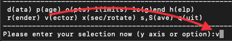

Changing the number of arrows on vector plots
~~~~~~~~~~~~~~~~~~~~~~~~~~~~~~~~~~~~~~~~~~~~~~

See :ref:`sec:vecpix`.

.. _sec:vecpix:

Changing the number of pixels in vector plots
~~~~~~~~~~~~~~~~~~~~~~~~~~~~~~~~~~~~~~~~~~~~~~

The number of pixels used on :ref:`sec:vectorplots` can be changed via the ``change
number of pixels`` option in the :ref:`sec:menu-v`. This controls the number
and average size of the arrows which appear (i.e., one arrow is plotted
at the centre of each pixel).

Changing the size of arrows on vector plots
~~~~~~~~~~~~~~~~~~~~~~~~~~~~~~~~~~~~~~~~~~~~

The size of the arrows on :ref:`sec:vectorplots` is proportional to the magnitude
of the vector quantity at that pixel, where the maximum size is set from
the maximum plot limit for the x, y and z components of the vector
quantity being plotted such that the longest arrow fills one pixel.
These limits can be changed manually via the :ref:`sec:menu-l` options. Where
these limits are nowhere near the actual values of the vector field,
arrows can appear either very big (just a line across the screen) or
extremely small (appearing as just dots). Pressing ``w`` in :ref:`sec:interactive`
automatically adjusts the arrows to sensible proportions (this is
the equivalent of pressing ``a`` for non-vector quantities). Alternatively
pressing ``v`` (to decrease) or ``V`` (to increase) can be used to adjust
the arrow lengths (the change can be multiplied by 10 or more by first
pressing ``z`` one or more times before pressing ``v`` or ``V``).

Plotting vector arrows in white instead of black or vice-versa
~~~~~~~~~~~~~~~~~~~~~~~~~~~~~~~~~~~~~~~~~~~~~~~~~~~~~~~~~~~~~~~

Vector arrows are by default plotted using the current foreground colour
index (i.e., as used for plotting the axes). To plot in the background
colour index instead set the ``use background colour for arrows`` option
in the :ref:`sec:menu-v`.

Turning off the legend for vector plots
~~~~~~~~~~~~~~~~~~~~~~~~~~~~~~~~~~~~~~~~

The legend which appears on :ref:`sec:vectorplots` can be turned on or off via the
``vector plot legend settings`` option in the :ref:`sec:menu-v`.

Moving the vector plot legend
~~~~~~~~~~~~~~~~~~~~~~~~~~~~~~

The position of the :ref:`sec:vectorplots` legend can be set either interactively
by positioning the mouse and pressing ``H`` or manually via the ``vector
plot legend settings`` option in the :ref:`sec:menu-v`.

Plotting stream/fieldlines instead of arrows
~~~~~~~~~~~~~~~~~~~~~~~~~~~~~~~~~~~~~~~~~~~~~

To plot :ref:`sec:vectorplots` that use stream/fieldlines instead of arrows, set
the ``plot stream/field lines instead of arrows`` option in the :ref:`sec:menu-v`.
This option performs a simple integration of the interpolated vector
field to get the stream function, the contours of which are then plotted

.. hint::
   The number of contours can be changed via the
   ``change number of contours`` option in the :ref:`sec:menu-r`. It is generally advantageous
   to use a larger number of pixels for the vector interpolation (See
   :ref:`sec:vecpix`) to get smooth contours.

At present this option works quite well for smooth vector fields but can
perform poorly for vector fields with strong gradients.

Turning arrow heads off for vector plots
~~~~~~~~~~~~~~~~~~~~~~~~~~~~~~~~~~~~~~~~~

:ref:`sec:vectorplots` can be plotted using arrows without heads using the ``turn
arrow heads on/off`` option in the :ref:`sec:menu-v`.

Hiding vector arrows where there are no SPH particles
~~~~~~~~~~~~~~~~~~~~~~~~~~~~~~~~~~~~~~~~~~~~~~~~~~~~~~

On :ref:`sec:renderplot` often arrows can appear where there are apparently no
SPH particles because the interpolation is performed to all pixels
within :math:`2h` of an SPH particle. Such arrows in regions of few or
no particles can be hidden using the ``hide arrows where there are no
particles`` option in the :ref:`sec:menu-v`. A threshold number of particles for
each pixel can be specified, below which no arrow will be plotted on
that pixel.

Plotting a vector plot in a cross section slice
~~~~~~~~~~~~~~~~~~~~~~~~~~~~~~~~~~~~~~~~~~~~~~~~

:ref:`sec:vectorplots` are either in a :ref:`sec:xsec` or are column
integrated projections depending on the setting of the ``switch between
cross section/projection`` option in the :ref:`sec:menu-x`. Setting this to cross
section and plotting :ref:`sec:vectorplots` produces a vector plot in a cross
section slice.

Making all arrow the same length (i.e., showing direction only, not magnitude)
~~~~~~~~~~~~~~~~~~~~~~~~~~~~~~~~~~~~~~~~~~~~~~~~~~~~~~~~~~~~~~~~~~~~~~~~~~~~~~~

An option to plot all vector arrows of the same length (instead of the
default option where the length of the arrow is proportional to the
vector magnitude) can be set from the :ref:`sec:menu-v`.

.. _sec:menu-x:

(x) cross section/3D plotting options
-------------------------------------

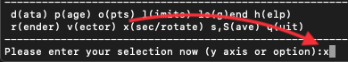

Plotting a cross section slice through 3D data
~~~~~~~~~~~~~~~~~~~~~~~~~~~~~~~~~~~~~~~~~~~~~~~

When plotting :ref:`sec:renderplot` of 3D data, the default option is to plot
a column-integrated plot. To change this to a :ref:`sec:xsec`, use
option 1) in the :ref:`sec:menu-x` (``switch between cross section/projection``).
See :ref:`sec:basic` for examples of how this works. An oblique
:ref:`sec:xsec` can be set interactively using the ``x`` key, see
:ref:`sec:obliquexsec` which works by setting a combination of
rotation and a :ref:`sec:xsec` position.

Plotting a cross section line through 2D data
~~~~~~~~~~~~~~~~~~~~~~~~~~~~~~~~~~~~~~~~~~~~~~

In 2D, setting the ``switch between cross section/projection`` option in
the :ref:`sec:menu-x` to :ref:`sec:xsec` means that :ref:`sec:renderplot` are in fact a 1D
:ref:`sec:xsec` (i.e., a line) through 2D data. The position of the line
is completely arbitrary (i.e., can be set for oblique cross sections as
well as straight lines) and is set interactively after the usual
:math:`y-` and :math:`x-` axis prompts.

Rotating the particles
~~~~~~~~~~~~~~~~~~~~~~~

An angle of rotation about may be set each axis may be set in the
:ref:`sec:menu-x` using the ``rotation on/off/settings`` option or
interactively (press ``h`` in :ref:`sec:interactive` to see the exact
keystrokes). The position of the origin about which particles are
rotated can be set from the ``rotation on/off/settings`` option in the :ref:`sec:menu-x`.
Rotated axes or boxes can be plotted using the ``set axes for
rotated/3D plots`` option in the same menu.

Rotations are performed in the order :math:`z-y-x`. This means that the
:math:`y-` rotation angle is an angle about the *new* :math:`y-`\ axis,
defined by the :math:`z` rotation and similarly for the :math:`x-`
rotation. If you think about it long enough, it makes sense. If in
doubt, do it interactively and set the angles in the order
:math:`z-y-x`.

Setting the origin about which particles are rotated
~~~~~~~~~~~~~~~~~~~~~~~~~~~~~~~~~~~~~~~~~~~~~~~~~~~~~

The origin about which particles are rotated and relative to which the
radius is calculated when the ``calculate extra quantities`` option is set
in the :ref:`sec:menu-d` can be changed via the ``rotation on/off/settings``
option in the :ref:`sec:menu-x`.

.. _sec:3Dperspective:

Adding 3D perspective
~~~~~~~~~~~~~~~~~~~~~~

3D perspective can be turned on via the ``3D perspective on/off`` option
in the :ref:`sec:menu-x`. Prompts for setting the perspective position then appear
after the usual prompts for y and x axes, :ref:`sec:renderplot` and :ref:`sec:vectorplots`,
i.e., something like the following:

::

   Please enter your selection now (y axis or option):2
   (x axis) (default=1):
    (render) (0=none) ([0:20], default=0):
    (vector plot) (0=none, 7=B, 10=v, 17=J) ([0:17], default=0):
    enter z coordinate of observer (default=1.800):
    enter distance between observer and projection screen ([0.000:], default=0.1800):
    Graphics device/type (? to see list, default /xwin):

3D perspective is defined by two parameters: a distance to the observer
:math:`zobs` and a distance between the observer and a screen placed in
front of the observer, :math:`dscreen`. The transformation from usual
:math:`x` and :math:`y` to screen :math:`x'` and :math:`y'` is then
given by

.. math::

   \begin{aligned}
   x' & = & x*dscreen/(zobs-z), \nonumber \\
   y' & = & y*dscreen/(zobs-z).\end{aligned}

This means that objects at the screen distance will have unit
magnification, objects closer than the screen will appear larger (points
diverge) and objects further away will appear smaller (points converge).
The situation could be beautifully illustrated if I could be bothered
drawing a figure. I have found reasonable results with something like a
:math:`1/10` reduction at the typical distance of the object (i.e.,
observer is placed at a distance of :math:`10\times` object size with
distance to screen of :math:`1\times` object size). splash sets this as
default using the z plot limit as the ‘object size’.

.. hint::
   The position of the 3D observer in :math:`z` can also be changed in
   :ref:`sec:interactive` using ``u`` or ``U`` (to move ’up’) and ``d`` or ``D`` (to move
   ``down``).

.. _sec:surface:

Using 3D surface rendering
~~~~~~~~~~~~~~~~~~~~~~~~~~~

3D surface rendering (turned on using the ``3D surface rendering on/off``
option in the :ref:`sec:menu-x`) performs a ray-trace through the particle data,
thus visualising the "last scattering surface". When set, the user is
prompted for an "optical depth" before plotting which determines the
position of the surface. Only applies to 3D data. When set with
cross-section (instead of projection), particles at or below the z value
of the slice are used.

For examples of the 3D surface rendering in splash , have a look at my
movies of neutron star mergers:

   http://users.monash.edu.au/~dprice/research/nsmag.

Plotting 3D box / 3D axes
~~~~~~~~~~~~~~~~~~~~~~~~~~

Rotated axes or boxes can be plotted using the ``set axes for rotated/3D
plots`` option in the :ref:`sec:menu-x`.

.. _sec:animseq:

Setting up animation sequences
~~~~~~~~~~~~~~~~~~~~~~~~~~~~~~~

Animation sequences can be set via the ``set animation sequence`` option
in the :ref:`sec:menu-x`. At present the possible sequences that can be added are:

::

    1 : steady zoom on x and y axes
    2 : steady rotation
    3 : steady change of limits (e.g. for colour bar)
    4 : steady movement of 3D observer
    5 : sequence of cross section slices through a 3D box
    6 : steady change of opacity for 3D surface plots

Up to one sequence of each type can be added (i.e., up to 6 in total)
with different start and end points (specified in terms of dump file
number), with the additional possibility of inserting extra frames
between dump files (e.g. to plot a sequence of frames consisting of a
changing view of the same dump file).

Animation sequences can also be set using ``e`` in :ref:`sec:interactive`. To
set a sequence interactively first adjust the plot settings to
correspond to the start of the sequence (pressing ``s`` to save if this is
done in :ref:`sec:interactive`). Then in :ref:`sec:interactive` move to the dump
file you want to be the end-point and also adjust the plot settings to
correspond to the end-point of your desired sequence (i.e., adjust the
colour bar limits and/or adjust the rotation angle and/or the x/y limits
and/or the 3D observer position and/or the opacity). Then, rather than
pressing ``s`` (which would make these become the default plot settings)
press ``e`` instead, saving these settings as the end-point of the desired
animation sequence. This can be done multiple times to set multiple
sequences.

Animation sequences set up in this manner are saved to a file called
``splash.anim`` either when prompted (if setting sequences
non-interactively) or by pressing ’S’ from the main menu which then
saves both the ``splash.limits`` and ``splash.anim`` files in addition
to the usual ``splash.defaults`` file.

**Note:** Animation sequences act on a ‘per page’
basis rather than simply ‘per frame’. This means that you can produce a
multi-panelled movie (e.g.) showing the evolution of different runs side
by side, with the same animation sequence applied to each.

Plotting a sequence of frames rotating a data set through 360 degrees
~~~~~~~~~~~~~~~~~~~~~~~~~~~~~~~~~~~~~~~~~~~~~~~~~~~~~~~~~~~~~~~~~~~~~~

This can be achieved by setting an animation sequence with a steady
change of rotation angle. See :ref:`sec:animseq`.

Plotting a ‘fly-around’ of 3D data
~~~~~~~~~~~~~~~~~~~~~~~~~~~~~~~~~~~

This can be achieved by setting an animation sequence with a steady
change of rotation angle. See :ref:`sec:animseq`.

Plotting a flythru of 3D data
~~~~~~~~~~~~~~~~~~~~~~~~~~~~~~

A sequence of :ref:`sec:xsec` slices progressively deeper into a 3D box or
alternatively a steady movement of the 3D observer (on projection plots)
can be plotted by setting up an animation sequence. See
:ref:`sec:animseq`.

Adding a steady zoom sequence to a movie
~~~~~~~~~~~~~~~~~~~~~~~~~~~~~~~~~~~~~~~~~

A steady change of :math:`x-` and :math:`y-` limits can be added by
setting up an animation sequence. See :ref:`sec:animseq`.

Adding a steady change of colour bar limits
~~~~~~~~~~~~~~~~~~~~~~~~~~~~~~~~~~~~~~~~~~~~

A steady change of limits on the colour bar over one or more dump files
for a movie can be implemented by setting up an animation sequence. See
:ref:`sec:animseq` for details.

.. _sec:move3Dobserver:

Adding steady movement of the 3D observer
~~~~~~~~~~~~~~~~~~~~~~~~~~~~~~~~~~~~~~~~~~

The position of the 3D observer can be steadily changed over several
dump files (or several frames produced of the same dump file) by setting
up an animation sequence. See :ref:`sec:animseq` for details.

Miscellaneous other useful things
---------------------------------

.. _sec:menu-h:

My attempt at in-built help
~~~~~~~~~~~~~~~~~~~~~~~~~~~~

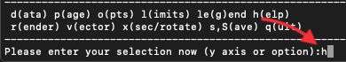

The :ref:`sec:menu-h` does nothing particularly useful apart
from tell you about menu shortcuts (see
:ref:`sec:menushortcuts`). It seemed like a good idea at the
time…

.. _sec:menushortcuts:

Keyboard shortcuts to menu options
~~~~~~~~~~~~~~~~~~~~~~~~~~~~~~~~~~~

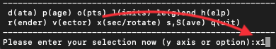

Menu options which normally require two keystrokes (e.g. x menu, option
1) can be shortcut to by simply typing the letter and number together at
the main menu prompt (so e.g. ``x1`` for x menu, option 1, ``r2`` for render
menu, option 2, etc.).

Exiting splash
~~~~~~~~~~~~~~~~

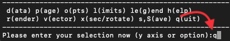

(q)uit, unsurprisingly, quits. Typing a number greater than the number
of data columns also exits the program (e.g. I often simply type 99 to
exit).
